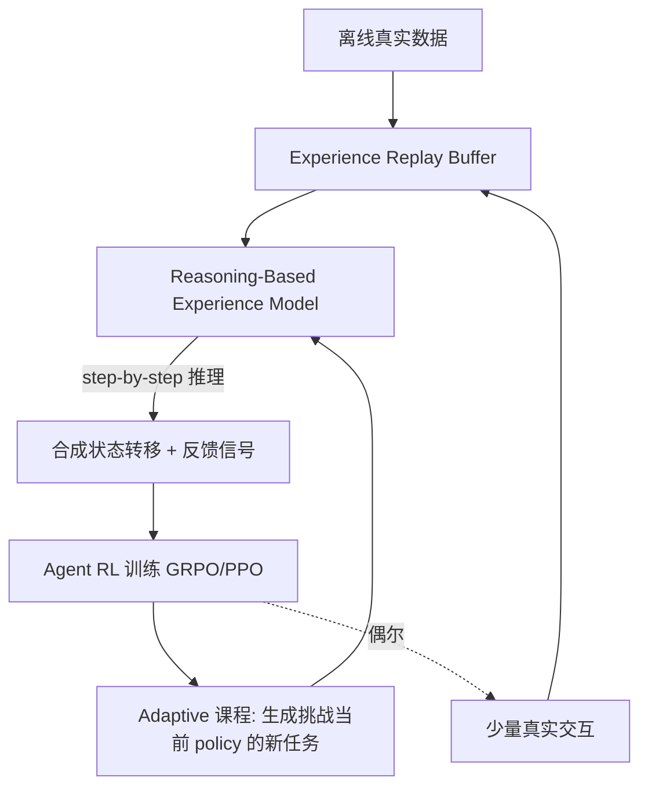

# DreamGym — 用「经验合成」让 Agent RL 摆脱真实 rollout

> **arXiv**：2511.03773（2025.11）｜**机构**：Meta（Jason Weston 等）｜**HF 月榜**：2025-11 #33，83↑
> **关键词**：Experience Synthesis · Online Agent RL · World Model for RL · Rollout-free

---

## 1. 这篇论文为什么重要

**一句话**：DreamGym 是**首个把"合成经验"做成统一框架、用于 online agent RL 训练**的工作——不用昂贵真实环境 rollout，纯靠一个"会推理的经验模型"产生状态转移与奖励，就能逼近 GRPO/PPO 的效果。

为什么是 2025 H2 的关键工作：

- **Agentic RL 的第一性约束是 rollout 成本**。真实 web/terminal/GUI 环境里跑一条 trajectory 要几十秒到几分钟、奖励稀疏且噪声大、基建复杂（要维护几千个容器）。这是 agent RL 工业落地最大的拦路虎。
- DreamGym 把问题重新框定为：**"环境动态"本身是可以被一个 LLM 学会并推理出来的**——既然如此，何必每一步都去真环境里执行？
- 这条思路（**experience-as-data / world-model-for-RL**）随后被 EvoCUA、Agent-World 等一批工作以不同形式延续，是 2026 H1"绕过真实 rollout"潮流的源头之一。

---

## 2. 核心方法

### 2.1 三大组件

### 2.2 Reasoning-Based Experience Model（最核心）

不直接预测"下一帧像素 / 下一段 HTML"，而是把环境动态**蒸馏成一个会 step-by-step 推理的模型**：给定 `(state, action)`，模型**推理出**一致的 `next_state` 与 `reward`。

- **关键洞察**：环境的状态转移逻辑往往是**可被语言推理刻画**的（"点了提交按钮 → 表单进入 pending → 若字段缺失则报错"），不需要逐像素生成就能给 RL 提供足够监督。
- **好处**：① 一致性——推理过程让合成转移不至于天马行空；② 便宜——一次 LLM 前向 vs 一次真实容器执行。

### 2.3 Experience Replay Buffer

- **离线真实数据初始化**——保证经验模型起点贴近真实分布；
- **持续用新交互补充**——随训练推进，buffer 不断纳入更可信的转移，提升 transition stability 与质量。

### 2.4 Adaptive 课程（online curriculum）

经验模型不仅产转移，还**自适应生成挑战当前 agent policy 的新任务**——难度随 policy 能力上升而上升，实现 online curriculum learning，避免任务过易/过难浪费样本。

---

## 3. 关键实验结果

| 设定 | 结果 |
| --- | --- |
| **WebArena（非 RL-ready 设定）** | 超所有基线 **30%+** |
| **RL-ready 但 rollout 昂贵的设定** | 仅用合成交互即**媲美 GRPO / PPO** |
| **Sim-to-real 迁移** | 用**远少于**真实交互量获得显著额外增益 |

> 论文用 GRPO 与 PPO 作为对照 RL 算法；核心卖点不是新 RL 算法，而是**"用什么数据喂 RL"**。

---

## 4. 对领域的影响 / 后续方向

### 🌟 影响

- 把 agent RL 的成本从"维护真实环境集群"降到"训练 + 调用一个经验模型"，**大幅降低复现门槛**。
- 确立 **world-model-for-RL** 在 LLM agent 语境下的可行性——经验模型用"推理"而非"像素生成"，避开了传统 video world model 的保真度/成本难题。

### ⚠ 局限

- 经验模型的**保真度上界**决定一切——若它对某类环境动态推理错误，会把 policy 带偏（sim-to-real gap 仍在，故需少量真实交互校准）。
- 对"需要精确数值/物理反馈"的环境（而非逻辑性状态机）适配性待验证。

### 🔮 趋势

1. 与 **EvoCUA**（[[06-evocua]]）形成对位：DreamGym 是"**合成经验代替 rollout**"，EvoCUA 是"**把真实 rollout 规模化 + 失败回收**"——两条降本路线。
2. 与 **Agentic World Modeling**（`huggingface/15`）呼应：经验模型本质是 L1/L2 级 world model 的"决策中心"用法。
3. 把"经验合成"与"演化 rubric"（[[12-dr-tulu]]）/"反思 consolidation"（[[02-experiential-rl]]）结合，是奖励/数据双侧丰富化的自然下一步。

---

## 5. 资源

- **arXiv**：https://arxiv.org/abs/2511.03773
- **HF Papers**：https://huggingface.co/papers/2511.03773
- **作者**：Zhaorun Chen, Zhuokai Zhao, Kai Zhang, Dawn Song, Bo Li, Jason Weston, Dat Huynh 等（18 作者，Meta）
- **GitHub**：未在 arXiv 页给出（以官方为准）
