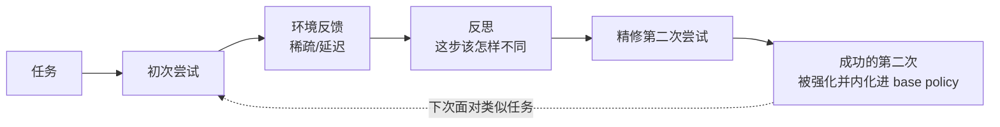

# Experiential RL (ERL) — 把「反思」显式嵌入强化学习循环

> **arXiv**：2602.13949（2026.02）｜**机构**：USC + Microsoft（Longqi Yang 等）｜**HF 月榜**：2026-02 #43，75↑
> **关键词**：Experience-Reflection-Consolidation · Sparse/Delayed Reward · Self-Refinement in RL

---

## 1. 这篇论文为什么重要

**一句话**：ERL 把人类"做错→反思→改进→把教训内化"的学习机制，**显式建成 RL 训练循环里的一等组件**，专门解决环境反馈稀疏且延迟时 LM 难以学习的问题。

为什么重要：

- 标准 RL 给 agent 的是**稀疏、延迟的标量奖励**——模型必须**隐式**推断"这次失败该如何转化为下次的行为改变"。这个隐式推断在长程任务里极其低效。
- ERL 的主张：**把这个推断显式化**——让模型自己写下"反思"，并用反思指导第二次尝试，再把成功的尝试**内化进 base policy**。
- 关键卖点：**部署时零额外推理开销**——反思只在训练时发生，推理时模型已经"学会了"，不需要再做 reflection。这区别于 Reflexion 等"推理时反思"方法。

---

## 2. 核心方法

### 2.1 Experience-Reflection-Consolidation 循环

四个阶段：

1. **Initial attempt**——模型对任务生成初次响应；
2. **Feedback**——接收环境反馈（成功/失败/中间信号）；
3. **Reflection**——产生一段反思，**显式刻画"哪里错了、该怎么改"**，用于指导改进；
4. **Consolidation**——精修后的第二次尝试若成功，则**被强化并内化进 base policy**——即把"反思+改进"的成果固化到权重里。

### 2.2 为什么有效

- **把反馈转为"结构化行为修正"**——标量奖励只说"好/坏"，反思说清"为什么 + 怎么改"，是更密的监督信号；
- **改善探索 + 稳定优化**——反思引导的第二次尝试比盲目重采样更可能成功，正样本更稳定；
- **consolidation 是关键**——不是把"反思"留到推理时用，而是训练时就把它的产物压进 policy，故部署时无额外开销。

---

## 3. 关键实验结果

| 任务类型 | 提升 |
| --- | --- |
| **复杂多步环境** | 最高 **+81%** |
| **工具使用推理任务** | 最高 **+11%** |

> 摘要给出的是区间增益；复杂多步环境收益尤其大——印证"反思机制对长程、稀疏奖励任务价值最高"的直觉。

---

## 4. 对领域的影响 / 后续方向

### 🌟 影响

- 把"self-refinement"从**推理时技巧**（Reflexion / 自我批评）转为**训练时机制**——成果内化、部署零开销，是工程上更优的形态。
- 与 MSR 的 **Experiential RL**（`huggingface/00` W08 提到的同名思想）/ Echo-Memory 一道，推动 **agent experience/memory** 成为 RL 训练的一阶组件。

### ⚠ 局限

- 依赖模型**自己写出有用反思**的能力——弱模型的反思可能噪声大（与 SkillsBench"self-generated skill 平均无收益"是同源的隐忧）；
- "成功的第二次尝试"作为正样本，若反思错误导致第二次也错，会引入坏监督。

### 🔮 趋势

1. 与 **OpenClaw-RL**（[[03-openclaw-rl]]）的 directive signal 思路同源——都在把"该怎么改"的方向性信息抽出来做监督，只是 ERL 靠模型自反思、OpenClaw-RL 靠 next-state hindsight。
2. 与 **DR Tulu** 演化 rubric（[[12-dr-tulu]]）、**MEDS** 错误记忆一道，构成"奖励信号丰富化"的不同切面。
3. 反思质量的可靠性（何时该信任自反思）是与 cross-model verification（`huggingface/07` ARIS）结合的自然接口。

---

## 5. 资源

- **arXiv**：https://arxiv.org/abs/2602.13949
- **HF Papers**：https://huggingface.co/papers/2602.13949
- **作者**：Taiwei Shi, Sihao Chen, Bowen Jiang, Linxin Song, Longqi Yang, Jieyu Zhao（USC + Microsoft）
- **GitHub**：未在 arXiv 页给出（以官方为准）
