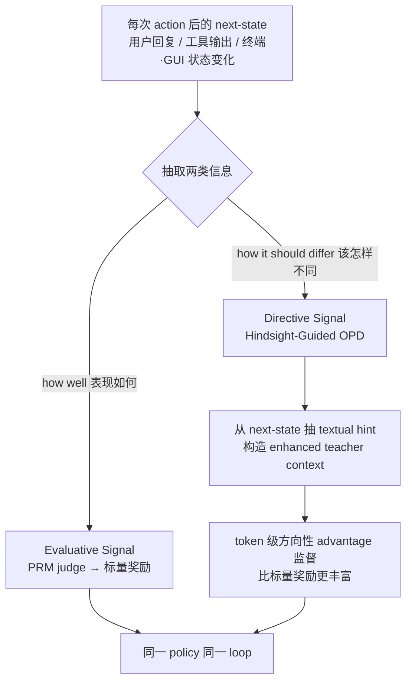

# OpenClaw-RL — 用「next-state 信号」把任意 agent 交互变成在线 RL

> **arXiv**：2603.10165（2026.03）｜**机构**：Princeton（Mengdi Wang / Ling Yang 等，Gen-Verse）｜**HF 月榜**：2026-03 #12，156↑
> **关键词**：Next-State Signal · Online Agentic RL · Hindsight OPD · Asynchronous Training · PRM
>
> 注：论文中的 "OpenClaw" 是对开放世界 agent 框架的代称（与本库 `huggingface/` 中 ClawBench / SkillClaw / ClawKeeper 同源命名）。

---

## 1. 这篇论文为什么重要

**一句话**：OpenClaw-RL 基于一个朴素却被忽视的观察——**每一次 agent 交互后产生的"下一个状态"（用户回复、工具输出、终端/GUI 状态变化）本身就是监督信号**，且所有这些信号可以**喂给同一个 policy、在同一个 loop 里训练**。

为什么重要：

- 过去 agentic RL 按领域割裂：terminal agent 一套 reward、GUI agent 一套、SWE 一套、对话一套。OpenClaw-RL 主张**它们不是不同的训练问题，而是同一类"交互"**——next-state signal 是**通用**的。
- 更关键：next-state 里**既有评价信息也有改进方向**。前者好抽（标量奖励），后者一直被浪费——OpenClaw-RL 用 **hindsight** 把"该怎么做才对"也抽出来做 token 级监督。
- 工程上：**全异步**——模型服务请求、PRM 评判、trainer 更新**同时进行、零协调开销**，把"agent 一边被使用一边变强"变成现实。

---

## 2. 核心方法

### 2.1 两类 next-state 信号

| 信号 | 含义 | 抽取方式 |
| --- | --- | --- |
| **Evaluative** | 这步动作**表现多好**（粗粒度、广覆盖） | **PRM judge** 抽成标量奖励 |
| **Directive** | 这步动作**该怎样不同**（细粒度、方向性） | **Hindsight-Guided OPD**——从 next-state 抽 textual hint，构造增强的 teacher context，给出 **token 级方向性 advantage** |

**核心创新**：Directive 信号——传统 RL 只用 evaluative（标量），白白丢掉了 next-state 里"正确做法长什么样"的信息。OpenClaw-RL 用 hindsight（事后看到了正确结果）反推 hint，做成比标量奖励**密得多**的 token 级监督。

### 2.2 异步训练架构（工程关键）

三个角色**同时运行、零协调**：

- **模型** serves live 请求（在线服务用户）；
- **PRM** 评判 ongoing 交互（产 evaluative 信号）；
- **Trainer** 更新 policy（吃两类信号）。

→ 实现"**agent 简单地被使用就能变强**"——从用户的 re-query、纠正、显式反馈里持续恢复对话信号。

### 2.3 统一覆盖四类领域

同一套基建支持 **terminal / GUI / SWE / tool-call** 的可扩展 RL；在通用 agent 场景额外验证了 **process reward** 的价值。**不再分领域定制 reward function**。

---

## 3. 关键实验结果

- **个人 agent 场景**：从用户 re-query / 纠正 / 显式反馈恢复对话信号，agent 在被使用中持续改进；
- **通用 agent 场景**：同一基建支持 terminal / GUI / SWE / tool-call 的可扩展 RL，并展示 process reward 的额外效用。

> 论文定位为"框架 + 基建"工作，核心贡献是**统一信号视角 + 异步训练架构**，而非单一 benchmark 刷分。

---

## 4. 对领域的影响 / 后续方向

### 🌟 影响

- 把"训 agent"从"专家手工定义 reward"降到"**普通对话/交互即监督**"——是 agent democratization 的代表性一步（呼应同 UNC/Princeton 系的 MetaClaw、"Just Talk"系列）。
- **统一信号视角**——首次明确"terminal/GUI/SWE/对话是同一类 next-state 学习问题"，为通用 agent RL 基建提供概念地基。

### ⚠ 局限

- **PRM judge 的质量**决定 evaluative 信号可靠性——judge 偏差会直接污染奖励；
- Hindsight hint 依赖"事后能看到正确结果"，对**没有明确正确答案**的开放任务（创意、长程研究）适配性待验证；
- 异步训练的稳定性（serve/judge/train 同时进行）对 log-prob drift 敏感——论文用 hint selection + log-prob-difference clipping 缓解。

### 🔮 趋势

1. 与 **ERL**（[[02-experiential-rl]]）的 directive 思路殊途同归——都在抽"该怎么改"，ERL 靠自反思、OpenClaw-RL 靠 next-state hindsight。
2. **异步 RL** 与 GLM-5（`huggingface/06`）的 slime 异步框架、GrandCode（`huggingface/01`）的 pipeline-RL 共同指向"rollout 与 update 解耦"成为大规模 agent RL 标配。
3. "被使用即训练"的在线学习闭环，是 personal AI assistant 持续个性化的关键路径（与 `memory/` 专题的隐私记忆形成"能力×记忆"双线）。

---

## 5. 资源

- **arXiv**：https://arxiv.org/abs/2603.10165
- **HF Papers**：https://huggingface.co/papers/2603.10165
- **作者**：Yinjie Wang, Xuyang Chen, Xiaolong Jin, Mengdi Wang, Ling Yang（Princeton / Gen-Verse）
- **GitHub**：https://github.com/Gen-Verse/OpenClaw-RL
