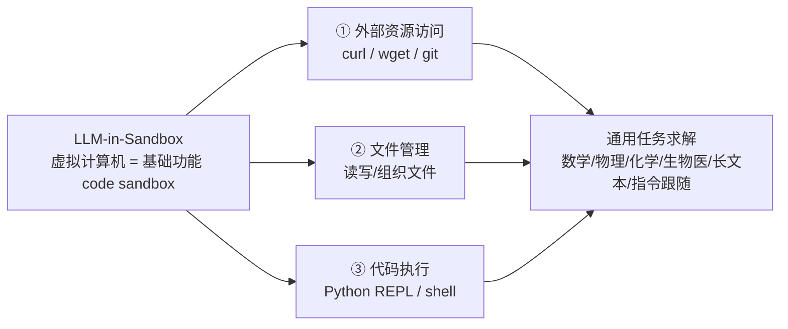

# LLM-in-Sandbox — 极简代码环境激发通用 Agentic 智能

> **arXiv**：2601.16206（2026.01）｜**机构**：Microsoft Research（Furu Wei 组）｜**HF 月榜**：2026-01 #38，87↑
> **论文正式标题**：*Computer Environments Elicit General Agentic Intelligence in LLMs*
> **关键词**：Code Sandbox · Non-Agentic Data RL · Meta-Capabilities · Token Efficiency

---

## 1. 这篇论文为什么重要

**一句话**：把计算机虚拟化为一个**只含基础功能的 code sandbox**（Python REPL + 文件系统 + shell，无浏览器/无 GUI/无复杂 API），就足以激发 LLM 的**通用任务求解元能力**——而且训练时**只需非 agentic 数据**。

为什么重要：

- 主流假设是"agent 必须配复杂 harness（LangChain / AutoGen 一大堆脚手架）"。本文反其道——**复杂脚手架反而把 LLM 自身的元能力封装隐藏了**。
- 还原到"**代码 + 文件 + 执行**"三件套后，LLM 反而能自由发挥；更反直觉的是：**用普通问答/代码数据（非 agent 轨迹）做 RL**，就能让弱模型学会驾驭这个环境。
- 结果是**双赢**：强模型免训练就 +15.5% 任务通过率，且 **token 消耗 -8×**——精简不仅不损性能，反而更高效。
- 来自 MSR（Furu Wei 组），与同组的 Experiential RL 一道，是"用极简环境 + RL 激发通用能力"路线的代表。

---

## 2. 核心方法

### 2.1 三大元能力（被极简 sandbox 激发）

把计算机还原为"仅含基础功能的 code sandbox"，自然激发三类元能力：① **外部资源访问**；② **文件管理**；③ **代码执行**。这三者足以覆盖广泛的非代码任务。

### 2.2 LLM-in-Sandbox-RL（关键训练方法）

- **核心反直觉点**：**只用非 agentic 数据**（普通问答 + 代码任务，而非专门构造的 agent 轨迹）在 sandbox 内做 RL；
- **效果**：让**较弱的模型**也学会"在 sandbox 内自由折腾"——驾驭环境、内化交互模式；
- **意义**：摆脱了"训 agent 必须有 agent 专用数据"的依赖——普通数据 + 好环境就够。

### 2.3 双重价值

| 模型 | 是否训练 | 效果 |
| --- | --- | --- |
| 强模型（如 GPT-5 级） | **免训练** | 任务通过率 **+15.5%**，token **-8×** |
| 弱模型 | LLM-in-Sandbox-RL | 学会驾驭 sandbox、内化交互能力 |

---

## 3. 关键实验结果

- **覆盖域**：数学、物理、化学、生物医、长上下文理解、指令跟随——**全是非代码任务**，证明"code sandbox 激发的是通用能力，不只是写代码"；
- **强模型免训练**：任务通过率最高 **+15.5%**；
- **效率**：token 消耗最高 **-8×**——精简环境反而更省。

---

## 4. 对领域的影响 / 后续方向

### 🌟 影响

- **质疑"agent 必须复杂 harness"的主流假设**——给出"sandbox + RL"的极简替代，与 LangChain/AutoGen 式重型框架形成鲜明对比。
- 与 **Code as Agent Harness**（`huggingface/20`）形成有趣张力：后者论证"代码是 agent 的 operational substrate"，本文则论证"**最小化的代码环境**已足够"——两者都把"代码/执行"放在 agent 设计的核心。

### ⚠ 局限

- 对**强依赖图形界面/浏览器交互**的任务（GUI agent、视觉 grounding）显然不适用——sandbox 无 GUI；
- "非 agentic 数据 RL"对弱模型的提升幅度、上限有多高，需更多模型规模验证。

### 🔮 趋势

1. 与 **Harness-1**（[[13-harness-1]]）构成"环境职责切分"的两极：LLM-in-Sandbox 把环境**做薄**（让模型自由发挥），Harness-1 把环境**做厚**（把状态管理外置）——**RL 该优化什么取决于环境怎么切分职责**。
2. "非 agentic 数据即可训 agent"与 DreamGym（[[01-dreamgym]]）"合成经验即可训 agent"共同降低 agent RL 的数据门槛。
3. 极简环境 + 通用元能力，是把 agent 能力"内生于模型"而非"外挂于框架"的代表方向。

---

## 5. 资源

- **arXiv**：https://arxiv.org/abs/2601.16206
- **HF Papers**：https://huggingface.co/papers/2601.16206
- **Project**：https://llm-in-sandbox.github.io
- **作者**：Daixuan Cheng, Shaohan Huang, Yuxian Gu, Huatong Song, Guoxin Chen, Li Dong, Wayne Xin Zhao, Ji-Rong Wen, Furu Wei（Microsoft Research）
