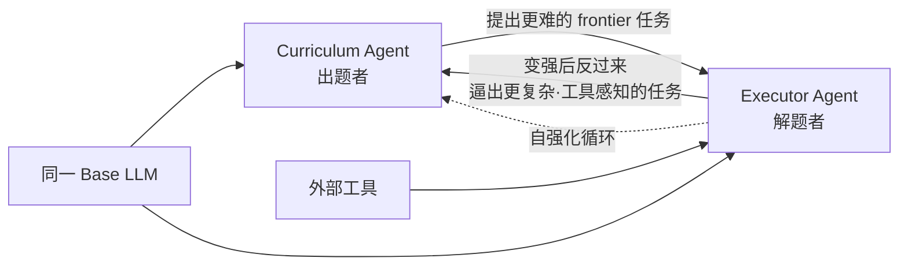

# Agent0 — 零数据、双 Agent 共进化 + 工具集成 RL

> **arXiv**：2511.16043（2025.11）｜**机构**：UNC-Chapel Hill（Huaxiu Yao 组，aiming-lab）｜**HF 月榜**：2025-11 #17，110↑
> **关键词**：Self-Evolving · Zero Data · Co-Evolution · Tool-Integrated Reasoning · Curriculum

---

## 1. 这篇论文为什么重要

**一句话**：Agent0 是一个**完全自主、零外部数据**的 agent 进化框架——从同一个 base LLM 长出两个相互竞争的 agent（出题者 vs 解题者），通过**多步共进化 + 工具集成**让 agent 不断变强，**不依赖任何人工标注数据**。

为什么重要：

- LLM agent 用 RL 训练时**严重依赖人类策划的数据**——这既限制规模，也把 AI 的能力上限**拴死在人类知识上**。
- 已有自演化框架的两大短板：① 受限于模型**自身能力**（自己出的题不会超过自己水平太多）；② 多是**单轮交互**，难以构造涉及工具使用/动态推理的复杂课程。
- Agent0 用**双 agent symbiotic competition** + **工具集成**同时破这两点——出题者持续提更难、更"工具感知"的任务，解题者被逼着变强，形成自强化飞轮。
- 来自 UNC Huaxiu Yao 组（同组后续有 SkillRL [[14-skillrl]]、MetaClaw），是 2025 H2"agent 摆脱人类数据天花板"方向的代表作。

---

## 2. 核心方法

### 2.1 双 Agent 共进化架构

- **Curriculum Agent（proposer / 出题者）**：提出**越来越有挑战性的 frontier 任务**——始终卡在解题者能力边缘，最大化学习信号；
- **Executor Agent（solver / 解题者）**：学习解决这些任务，**集成外部工具**增强求解力；
- **symbiotic competition（共生竞争）**：两者从同一 base 初始化，但目标对抗——解题者变强 → 反过来"**pressure**"出题者构造更复杂、更工具感知的任务 → 又逼解题者继续变强。

### 2.2 工具集成推理（Tool-Integrated Reasoning）

- 外部工具被集成进**解题者**的求解过程，提升其问题求解能力；
- 关键耦合：解题能力提升后，**出题者必须构造"工具感知"的更难任务**才能继续制造挑战——工具不是孤立模块，而是驱动课程升级的引擎。

### 2.3 零数据自演化

- **无任何外部数据**——任务由 curriculum agent 自动生成，监督来自共进化过程本身；
- 多步交互（非单轮）让 agent 能学习涉及工具使用、动态推理的复杂行为。

---

## 3. 关键实验结果

基于 **Qwen3-8B-Base**：

| 能力 | 提升 |
| --- | --- |
| 数学推理 | **+18%** |
| 通用推理 | **+24%** |

> 全程**零外部数据**——增益完全来自双 agent 共进化 + 工具集成 RL。

---

## 4. 对领域的影响 / 后续方向

### 🌟 影响

- 证明 agent 可以"**自己造课程、自己出题、自己进化**"——摆脱人类数据天花板，是 self-evolving agent 范式的有力实证。
- **出题者-解题者对抗**是一种优雅的 curriculum 自动化——天然把任务难度卡在能力边缘（类似 self-play 的课程版）。

### ⚠ 局限

- 共进化的**能力上限**仍受 base 模型约束——出题者再强也很难提出远超自身理解的任务（self-improvement 的根本难题）；
- 任务质量/多样性依赖出题者，缺乏外部锚点时可能陷入"自洽但偏离真实分布"的循环（与 `huggingface/15` Moltbook"自演化三难"同源隐忧）。

### 🔮 趋势

1. 与 **SkillRL**（[[14-skillrl]]）/ **MetaClaw**（同组）形成"自演化 agent"系列——从能力共进化到技能库共进化到部署中演化。
2. 与 **DreamGym**（[[01-dreamgym]]）/ **EvoCUA**（[[06-evocua]]）共享"自动造任务/环境"内核，只是 Agent0 侧重"出题者-解题者对抗"这一课程机制。
3. 与 `huggingface/` SkillClaw（生态级集体进化）、`evolve/` 专题构成"agent 自演化"的完整图谱。

---

## 5. 资源

- **arXiv**：https://arxiv.org/abs/2511.16043
- **HF Papers**：https://huggingface.co/papers/2511.16043
- **作者**：Peng Xia, Kaide Zeng, Jiaqi Liu, Can Qin, Fang Wu, Yiyang Zhou, Caiming Xiong, Huaxiu Yao（UNC 等）
- **GitHub**：https://github.com/aiming-lab/Agent0
