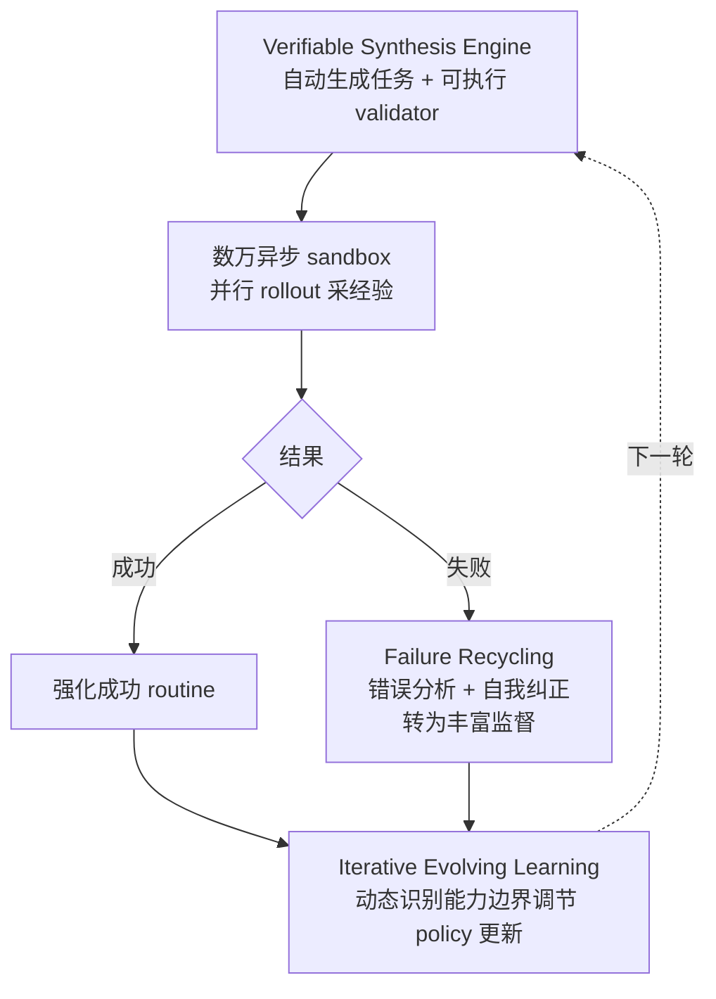

# EvoCUA — 自维持进化的 Computer Use Agent（万级异步沙箱 + 失败回收）

> **arXiv**：2601.15876（2026.01）｜**机构**：美团（Xipeng Qiu 等）｜**HF 月榜**：2026-01 #35，92↑
> **关键词**：Computer Use Agent · Synthetic Experience · Async Sandbox Rollout · Failure Recycling · OSWorld SOTA

---

## 1. 这篇论文为什么重要

**一句话**：EvoCUA 把**数据生成与 policy 优化合并成一个自维持的进化循环**，靠"可验证任务合成 + 数万异步沙箱并行 rollout + 失败轨迹回收"训出 OSWorld **56.7% 开源 SOTA** 的原生 computer use agent。

为什么重要：

- 原生 CUA（直接操作 GUI 的 agent）的潜力被**静态数据 scaling 的天花板**卡住——主流做法是被动模仿静态数据集，覆盖不了真实操作的长尾。
- EvoCUA 的破法：不靠"采更多静态数据"，而是**让 agent 在可验证的合成环境里大规模主动尝试**，并把成败都转化为训练信号。
- 是 [[01-dreamgym]] "经验合成"思路在 **GUI 域**的另一种实现——DreamGym 合成"经验模型"代替 rollout，EvoCUA 则**把真实 rollout 规模化到数万并行 + 回收失败**。
- 与字节 EvoCUA（同名不同篇，`huggingface/00` W04 的 Meituan EvoCUA）一脉——美团在 CUA 自演化方向的代表作。

---

## 2. 核心方法

### 2.1 自维持进化循环（三件套）

| 组件 | 作用 |
| --- | --- |
| **① Verifiable Synthesis Engine** | 自动生成**多样任务 + 可执行 validator**——每个任务都能自动判分，解决数据稀缺 |
| **② 可扩展基建** | 编排**数万异步 sandbox rollout**，大规模采集经验（异步 → 不被慢任务阻塞，吞吐远超同步） |
| **③ Iterative Evolving Learning** | **动态识别能力边界**调节 policy 更新——针对当前薄弱处优先训练 |

### 2.2 失败回收（Failure Recycling，关键创新）

- 不只强化成功轨迹，更**把失败轨迹转化为丰富监督**——通过**错误分析 + 自我纠正**，让失败 trajectory 提供"诊断 + 修复"信号；
- 与 `huggingface/02` TermiGen 的"主动错误注入"异曲同工——**失败数据是 agent 训练的宝藏，不该被过滤掉**。

### 2.3 异步沙箱的工程意义

- **数万容器并行**——agent 同时尝试上万任务，效率比同步训练高一个数量级；
- 可验证 validator 让每条 rollout 的奖励**自动、可靠**——这是大规模 RL 能稳定运转的前提。

---

## 3. 关键实验结果

| 模型 | OSWorld 成功率 |
| --- | --- |
| **EvoCUA** | **56.7%**（开源 SOTA） |
| UI-TARS-2（闭源） | 53.1% |
| OpenCUA-72B（前开源最佳） | 45.0% |

- **超越闭源 UI-TARS-2**——证明"合成 + 自演化"路线可反超闭源；
- 在**多种规模的 foundation model** 上一致增益——方法不挑底座。

---

## 4. 对领域的影响 / 后续方向

### 🌟 影响

- 把"环境自动合成 + 大规模并行 RL + 失败数据回收"整合为**可持续运转的工业级 CUA 生产线**——是 CUA 训练从"静态数据"到"自维持循环"的范式转变。
- **失败回收**进一步印证 2026 H1 共识：**失败轨迹 = 高质量"诊断+修复"监督**（与 TermiGen、`huggingface/00` 多篇呼应）。

### ⚠ 局限

- 依赖**可执行 validator** 的覆盖度——validator 写不出的任务类型无法自动判分，限制可合成任务空间；
- 数万沙箱的**基建成本**仍高（虽比真实人工标注省，但需大规模容器集群）。

### 🔮 趋势

1. 与 **DreamGym**（[[01-dreamgym]]）形成 CUA 降本两路：合成经验 vs 规模化真实 rollout。
2. 与 **Agent-World**（字节 Seed，简述）/ **CUDA Agent**（[[07-cuda-agent]]）共享"可验证环境 + 大规模 agentic RL"内核——证明该范式可跨域（GUI / 系统软件）。
3. 与 `huggingface/` 的 GroundCUA、CUA-Suite、Video2GUI 等数据侧工作互补——EvoCUA 是"自动合成"，它们是"人标/挖视频"。

---

## 5. 资源

- **arXiv**：https://arxiv.org/abs/2601.15876
- **HF Papers**：https://huggingface.co/papers/2601.15876
- **作者**：Taofeng Xue, Chong Peng, Mianqiu Huang, … Xunliang Cai, Xipeng Qiu（美团）
- **GitHub**：以官方发布为准（HF 页未直接给出）
