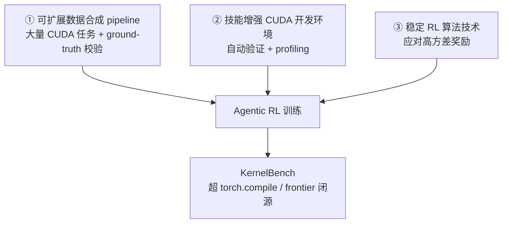

# CUDA Agent — 大规模 Agentic RL 自动写高性能 CUDA Kernel

> **arXiv**：2602.24286（2026.03）｜**机构**：ByteDance Seed（BytedTsinghua-SIA）｜**HF 月榜**：2026-03 #37，99↑
> **关键词**：Agentic RL for Systems · CUDA Kernel · KernelBench · Verifiable Reward · High-Variance Reward

---

## 1. 这篇论文为什么重要

**一句话**：CUDA Agent 用**大规模 agentic RL** 自动编写高性能 CUDA kernel，在 KernelBench 上**全面超越 `torch.compile`**（L1/L2 100%、L3 92%），且 L3 比 Claude Opus 4.5 / Gemini 3 Pro **高约 40%**——是"agent for systems"方向最有冲击力的工作之一。

为什么重要：

- GPU kernel 优化是**最专家化的系统软件任务之一**——需要深厚硬件知识，LLM 在通用编程强、但写 CUDA 一直**打不过基于编译器的系统**（torch.compile 等）。
- CUDA Agent 证明：只要有**可靠的自动验证 + profiling 奖励**，agentic RL 能在这个"硬骨头"领域**反超 frontier 闭源模型**。
- 与 GrandCode（`huggingface/01`，竞赛编程超人类）一道，标志着 **agentic RL 在"有可靠验证器"的专家领域已能反超最强闭源**——不再只是"追平"。
- 来自字节 Seed × 清华 SIA，工程规模与严谨度都是工业级。

---

## 2. 核心方法

### 2.1 三大组件

| 组件 | 作用 |
| --- | --- |
| **① 数据合成 pipeline** | 大批量自动生成 CUDA 任务 + **ground-truth 校验**（保证有正确参照） |
| **② 技能增强 CUDA 开发环境** | **自动验证**（编译 + 数值正确性）+ **profiling**（吞吐/延迟/占用率）→ 提供**可靠奖励信号**；含错误诊断 |
| **③ 稳定 RL 算法技术** | 专门应对 CUDA 性能奖励的**高方差**（性能可跨数量级），稳定训练 |

### 2.2 可靠奖励是关键

CUDA kernel 的好坏有**客观、可自动测量**的标准——能否编译、数值是否正确、跑多快。CUDA Agent 把这三层做成**自动奖励**：

1. **正确性**——编译失败 / 数值错误 = 不合格；
2. **性能**——通过 profiling 测吞吐/延迟/占用率，作为效率奖励。

这正是 agentic RL 能在此领域反超闭源的根本——**有可靠的、可自动计算的 verifier**（与 GrandCode 的三阶段 reward 哲学一致）。

### 2.3 高方差奖励的稳定化

- CUDA 性能跨数量级（一个 kernel 可能比另一个快 100×），原始奖励方差极大；
- 论文用专门的 RL 算法技术（对数化 / clipping / warmup 一类）稳定训练——这是大规模性能驱动 RL 能收敛的工程前提。

---

## 3. 关键实验结果

**KernelBench**（vs `torch.compile` 的 faster rate）：

| Level | 超越 torch.compile 的比例 |
| --- | --- |
| **Level-1**（基础） | **100%** |
| **Level-2**（中等） | **100%** |
| **Level-3**（复杂） | **92%** |

- **Level-3 比 Claude Opus 4.5 / Gemini 3 Pro 高约 40%**——在最难档反超最强闭源；
- 基础到中等难度**全面超越静态编译器**。

---

## 4. 对领域的影响 / 后续方向

### 🌟 影响

- 证明 **agent 可在系统软件开发（CUDA 这种最专家化领域）超越 frontier 闭源**——预示 AI 自动优化 GPU 代码成为新现实。
- 与 GrandCode 一道确立："**有可靠自动 verifier 的领域，agentic RL 能反超闭源**"——把可验证性作为 agent RL 成功的核心前提。

### ⚠ 局限

- 强依赖**可自动验证 + profiling 的环境**——迁移到没有客观性能指标的任务（如设计、研究）不直接适用；
- CUDA 领域知识的合成数据质量、覆盖度决定能力边界。

### 🔮 趋势

1. **可验证奖励 = agentic RL 反超闭源的钥匙**——CUDA Agent（性能 profiling）、GrandCode（测试用例）、DR Tulu（演化 rubric [[12-dr-tulu]]）都在解决"奖励从哪来、可不可靠"。
2. 与 **EvoCUA**（[[06-evocua]]）/ **Agent-World** 共享"可验证环境 + 大规模 agentic RL"范式，跨域复制（系统软件 / GUI）。
3. "agent for systems"（CUDA / 编译器 / DevOps）是 agentic RL 下一个高价值落地方向。

---

## 5. 资源

- **arXiv**：https://arxiv.org/abs/2602.24286
- **HF Papers**：https://huggingface.co/papers/2602.24286
- **作者**：Weinan Dai, Hanlin Wu, Qiying Yu, … Mingxuan Wang, Xin Liu, Hao Zhou（ByteDance Seed / 清华 SIA）
- **GitHub**：https://github.com/BytedTsinghua-SIA/CUDA-Agent
