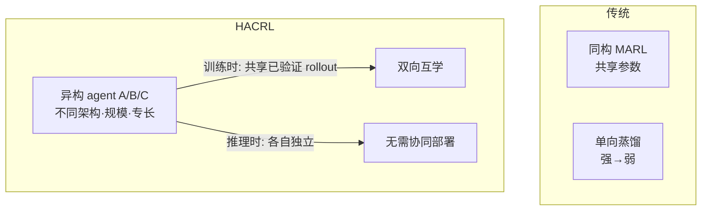

# HACRL — 异构 Agent 协作强化学习（训练时互学、推理时独立）

> **arXiv**：2603.02604（2026.03）｜**机构**：Beihang 等（Shuai Ma / Jianxin Li / Yikun Ban 等）｜**HF 月榜**：2026-03 #6，198↑
> **关键词**：Heterogeneous MARL · Bidirectional Mutual Learning · HACPO · RLVR · Unbiased Advantage

---

## 1. 这篇论文为什么重要

**一句话**：HACRL 提出一种新的 RLVR 范式——**多个异构 agent 在训练时共享已验证 rollout 互相提升、在推理时各自独立运行**，靠 HACPO 算法实现**双向互学**，比 GSPO（双倍 rollout 的强基线）**+3.6%、计算仅一半**。

为什么重要：

- 传统 multi-agent RL 要么是**同构 agent**（共享参数）要么是**单向蒸馏**（强→弱）。HACRL 主张**异构 agent 之间双向互学**——不同架构/规模/专长的 agent 互相改进。
- 关键设计哲学：**协作优化、独立执行**——训练时享受协作红利（共享成功经验），推理时**无需协同部署**（避免 LLM-MARL 那种昂贵的多 agent 在线协调）。
- 难点在于异构带来的**能力差异 + 策略分布漂移**会让朴素的 advantage 共享有偏——HACRL 用 HACPO + 理论保证解决。
- 是 multi-agent RL 从"同构/单向"走向"异构/双向"的工程化代表，HF 月榜 198 票（当月 agent+RL 类最高之一）。

---

## 2. 核心方法

### 2.1 范式对比

| | 协调需求 | 知识流向 |
| --- | --- | --- |
| LLM-based MARL | 需协同部署 | 多向但在线 |
| On/Off-policy 蒸馏 | 无 | **单向**（teacher→student） |
| **HACRL** | **推理时无需协同** | **双向互学** |

### 2.2 HACPO 算法

**Heterogeneous Agent Collaborative Policy Optimization**——做**有原则的 rollout 共享**以最大化样本利用与跨 agent 知识迁移：

- 异构 agent 把**各自产生的、已验证的成功 rollout** 拿出来共享，互相作为高质量训练样本；
- 引入**4 个针对性机制**处理"能力差异 + 策略分布漂移"，并带**无偏 advantage 估计的理论保证**（这是异构共享能稳定的关键——若直接拿别的 agent 的 rollout 算 advantage 会因分布不匹配而有偏）。

> 注：摘要确认"4 个机制 + 理论保证无偏"，但未逐一命名机制（如 cross-arch normalization 等需查正文 HTML）。核心是**无偏的跨 agent advantage 共享**。

### 2.3 协作优化、独立执行

- **训练时**：agent 间共享 verified rollout → 每个 agent 都因"看到队友的成功经验"而提升；
- **推理时**：各 agent 独立运行——**没有多 agent 在线协调开销**，部署成本与单 agent 相同。

---

## 3. 关键实验结果

| 对比 | 结果 |
| --- | --- |
| **HACPO vs GSPO（双倍 rollout）** | **+3.6%** 平均提升 |
| **rollout 成本** | **仅一半** |

- HACPO **一致提升所有参与的 agent**——不是牺牲弱者补强者，而是双赢；
- 效率优势显著：用一半算力超过双倍 rollout 的强基线。

---

## 4. 对领域的影响 / 后续方向

### 🌟 影响

- 把"协作"从**同构**走向**异构**（不同模型架构/规模/专长 agent），是 multi-agent RL 工程化的重要一步。
- "**训练时协作、推理时独立**"是一个很实用的解耦——既要协作红利又避开在线多 agent 协调的成本/延迟。
- **无偏 advantage 共享的理论保证**为"异构 rollout 复用"提供了可靠地基。

### ⚠ 局限

- 异构 agent 间**能力差距过大**时，共享 rollout 的有效性可能下降（强者的 rollout 对弱者太难、弱者的对强者太易）；
- 需要每个 agent 都能产出"已验证"的 rollout——依赖可验证奖励环境。

### 🔮 趋势

1. 与 **MATTRL**（[[09-mattrl]]，测试时多 agent RL）、**WideSeek-R1**（[[10-wideseek-r1]]，宽度扩展 MARL）一道，构成 2026 H1 **MARL 三种新解法**——异构互学 / 测试时 / 宽度扩展。
2. 与 GrandCode 的 Agentic GRPO（`huggingface/01`）、SDAR（`huggingface/08`）共享"**多轮/多 agent 信用分配精细化**"主题——HACRL 的贡献是**跨 agent 无偏 advantage**。
3. "异构 rollout 复用"可与 DreamGym（[[01-dreamgym]]）合成经验结合——共享的不只是真实 rollout，还可以是合成经验。

---

## 5. 资源

- **arXiv**：https://arxiv.org/abs/2603.02604
- **HF Papers**：https://huggingface.co/papers/2603.02604
- **作者**：Zhixia Zhang, Zixuan Huang, … Shuai Ma, Ning Ding, Yaodong Yang, Jianxin Li, Yikun Ban（Beihang 等）
- **GitHub**：以官方发布为准（HF 页未直接给出）
