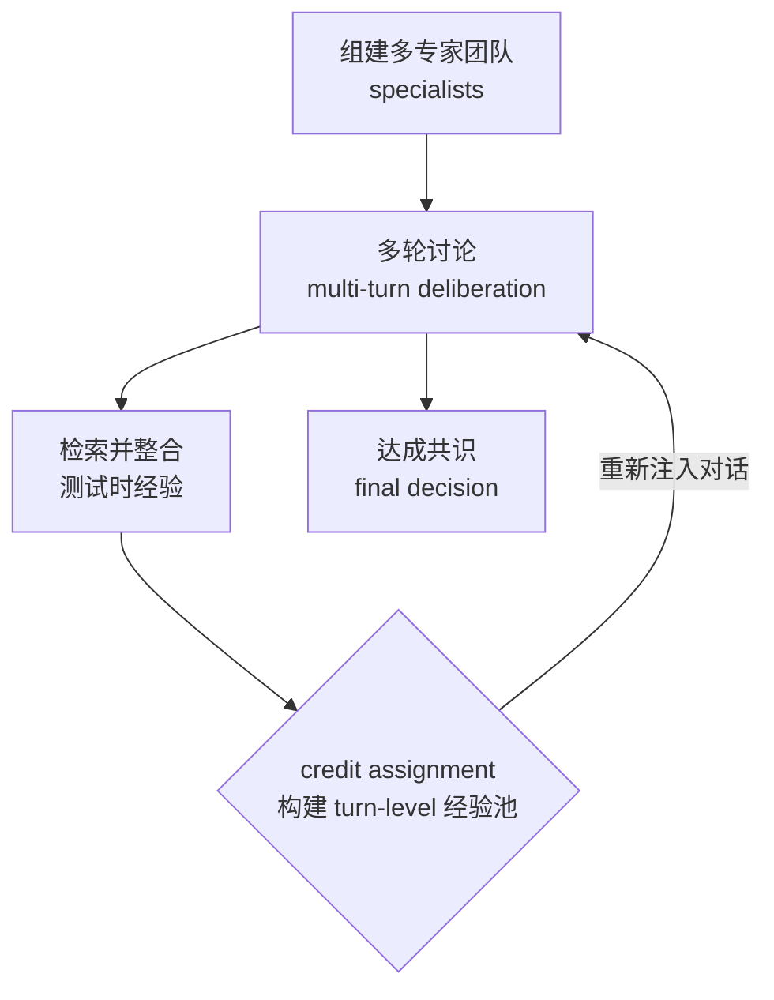

# MATTRL — 多 Agent 测试时强化学习（不更新权重）

> **arXiv**：2601.09667（2026.01）｜**机构**：NUS / MIT（Bryan Hooi / Cynthia Breazeal / Hae Won Park 等）｜**HF 月榜**：2026-01 #36，92↑
> **关键词**：Multi-Agent Test-Time RL · Textual Experience · Credit Assignment · No Weight Update

---

## 1. 这篇论文为什么重要

**一句话**：MATTRL 把 RL 的"经验积累"机制搬到**推理时的多 agent 审议**里——**不更新任何权重**，而是把结构化文本经验注入多 agent 讨论，靠"经验检索 + 多轮讨论 + 共识"提升推理，绕开了 MARL 训练的资源与不稳定难题。

为什么重要：

- multi-agent RL（MARL）训练**资源重且不稳定**——队友 co-adapting 导致**非平稳性**，奖励**稀疏且高方差**。这让"训练式 MARL"在很多场景不实用。
- MATTRL 的破法：**把 RL 挪到测试时**——不训权重，而是构建一个**turn-level 经验池**，在多 agent 多轮讨论中**检索并注入**结构化文本经验，让 agent 团队"边讨论边用过去的教训"。
- 这是一条与 HACRL（[[08-hacrl]]，训练式异构 MARL）正交的路线——**test-time RL** 把"经验"做成可即插即用的文本资产，零训练成本。
- 来自 NUS + MIT Media Lab（Cynthia Breazeal / Hae Won Park），与 MIT 系的 Uniqueness-Aware RL、Collaborative TTRL 同源。

---

## 2. 核心方法

### 2.1 测试时多 agent RL 流程

四个环节：

1. **组建多专家团队**——多个 specialist agent 准备多轮讨论；
2. **检索并整合测试时经验**——从经验池取相关历史经验注入当前讨论；
3. **达成共识**——多轮讨论后形成最终决策；
4. **credit assignment**——研究**turn-level 经验池**的构建（哪一轮发言贡献了好结果），再把提炼的经验**重新注入对话**。

### 2.2 关键：零权重更新

- **"without tuning"**——整个机制在**推理时**完成，不改任何参数；
- 经验以**结构化文本**形式存在、检索、注入——是一种"RL 的精神（经验积累 + 信用分配）+ 文本载体"的组合；
- 这避开了 MARL 训练的非平稳与高方差——因为根本不训练，只是把"过去哪些讨论模式有效"作为文本经验复用。

### 2.3 turn-level credit assignment

- 多 agent 多轮讨论里，**哪一轮、哪个 agent 的发言**真正推动了正确结论？MATTRL 显式研究这个信用分配；
- 把高贡献的 turn 提炼进经验池，下次类似讨论时注入——形成"测试时的经验飞轮"；
- 论文用 ablation 比较不同 credit-assignment 方案。

---

## 3. 关键实验结果

| 对比 | 平均准确率提升 |
| --- | --- |
| vs 多 agent 基线 | **+3.67%** |
| vs 单 agent 基线 | **+8.67%** |

- 覆盖**医学、数学、教育**多领域；
- ablation 检验不同 credit-assignment 方案的影响。

---

## 4. 对领域的影响 / 后续方向

### 🌟 影响

- 提供 MARL 的**零训练替代**——在"训练式 MARL 太贵/不稳"的场景，test-time 经验注入是实用解法。
- 把"经验积累 + 信用分配"这两个 RL 核心概念**剥离出权重训练**，证明它们可以纯靠文本机制在推理时实现——与 `huggingface/05` Youtu-Agent 的 Training-free GRPO 精神一致（都是"frozen model + 文本侧优化"）。

### ⚠ 局限

- 提升幅度（+3.67% / +8.67%）**不如训练式方法激进**——test-time 方法天花板受限于"不改权重"；
- 依赖**经验检索质量**与讨论协议设计——经验池噪声会拖累讨论。

### 🔮 趋势

1. 与 **HACRL**（[[08-hacrl]]，训练式异构）、**WideSeek-R1**（[[10-wideseek-r1]]，训练式宽度扩展）一道，构成 MARL 三种新解法——MATTRL 占据"**测试时/零训练**"这一极。
2. 与 `huggingface/` 的 Training-free GRPO（Youtu-Agent）、Recursive MAS（latent 通信）共同探索"multi-agent 协作如何低成本提升"。
3. "测试时经验池"与 `memory/` 专题的 working memory、`huggingface/` Experiential RL 形成"经验作为一等组件"的跨库主题。

---

## 5. 资源

- **arXiv**：https://arxiv.org/abs/2601.09667
- **HF Papers**：https://huggingface.co/papers/2601.09667
- **作者**：Zhiyuan Hu, Yunhai Hu, … See-Kiong Ng, Bryan Hooi, Cynthia Breazeal, Hae Won Park（NUS / MIT 等）
- **GitHub**：https://github.com/zhiyuanhubj/MATTRL
