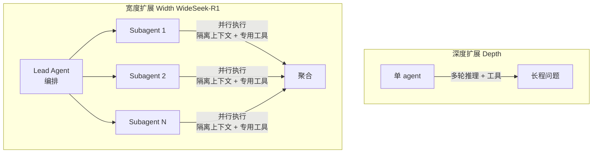

# WideSeek-R1 — 宽度扩展：用 Multi-Agent RL 做广度信息检索

> **arXiv**：2602.04634（2026.02）｜**机构**：清华 / RLinf（Chao Yu / Yu Wang 等）｜**HF 月榜**：2026-02 #30，100↑
> **关键词**：Width Scaling · Lead-Subagent · MARL · Broad Information Seeking · Parallel Execution

---

## 1. 这篇论文为什么重要

**一句话**：WideSeek-R1 提出与"深度扩展"互补的"**宽度扩展**"——用 **lead-agent–subagent 多 agent 框架 + MARL 训练**把广度信息检索**并行化**，让 4B 模型在 WideSearch 上**媲美 671B 单 agent**。

为什么重要：

- LLM 的能力扩展过去主要走**深度**——单个 agent 用多轮推理 + 工具调用解长程问题。但当任务变**广**（需要同时覆盖很多并行子问题），瓶颈从"个体能力"转为"**组织能力**"。
- 现有 multi-agent 系统多靠**手工 workflow + 轮流交互**，**无法有效并行**。WideSeek-R1 用 MARL **联合训练** lead 与 subagent，让它们学会真正的并行分工。
- "宽度 vs 深度"是一个清晰的新坐标——为 agent scaling 提供了正交于"更长推理"的维度。
- 来自清华 + RLinf（同框架下还有 π_RL 等 VLA RL 工作），MARL 训练基建扎实。

---

## 2. 核心方法

### 2.1 深度扩展 vs 宽度扩展

| | 解什么 | 瓶颈 |
| --- | --- | --- |
| **深度扩展** | 单 agent 多轮解长程问题 | 个体能力 |
| **宽度扩展** | 多 agent 并行解广度问题 | **组织能力** |

### 2.2 Lead-Agent–Subagent 框架

- 用**一个共享 LLM + 隔离上下文 + 专用工具**实现——lead agent 负责**编排**，并行 subagent 负责**执行**；
- 批判现有 multi-agent 系统的"手工 workflow + 轮流交互"——它们**无法有效并行**，WideSeek-R1 要解决的正是"如何让工作真正并行展开"。

### 2.3 MARL 联合训练

- **联合优化 lead agent 与并行 subagent**——在一个 **20k 广度信息检索任务**的精选数据集上训练；
- 让模型学会"**协同编排 + 并行执行**的协同效应"——不是 prompt 工程拼出来的多 agent，而是 RL 训出来的并行组织能力。

---

## 3. 关键实验结果

| 指标 | 数值 |
| --- | --- |
| **WideSeek-R1-4B** item F1（WideSearch） | **40.0%** |
| 对照 | 媲美**单 agent DeepSeek-R1-671B** |

- **4B 媲美 671B 单 agent**——宽度扩展用小模型 + 并行组织达到大模型单体的效果；
- **并行 subagent 数量增加 → 性能持续提升**——宽度可扩展。

---

## 4. 对领域的影响 / 后续方向

### 🌟 影响

- 提出 **"宽度扩展"** 这一与深度正交的 scaling 维度——对"广度信息检索 / wide research"类任务尤其重要（呼应 `huggingface/` 的 Wide Research 主题）。
- 证明 **MARL 能训出真正的并行组织能力**——而非手工 workflow——是 multi-agent 系统从"prompt 拼装"到"RL 训练"的代表。

### ⚠ 局限

- 适用面偏"**可分解为并行子任务**"的广度任务——对必须串行深推的问题，宽度扩展帮助有限；
- 共享 LLM + 隔离上下文的设计，subagent 间的协调质量依赖 lead agent 的编排能力。

### 🔮 趋势

1. 与 **HACRL**（[[08-hacrl]]）、**MATTRL**（[[09-mattrl]]）构成 MARL 三种新解法——WideSeek-R1 占据"**宽度扩展 / 并行组织**"这一极。
2. 与 `huggingface/` 的 SearchSwarm（委派智能）、Recursive MAS（递归调用）共同探索"多 agent 如何高效组织长程/广度任务"。
3. "宽度 × 深度"双维 scaling 是 deep research agent（[[11-iterresearch]] 深度、WideSeek-R1 宽度）设计的互补坐标。

---

## 5. 资源

- **arXiv**：https://arxiv.org/abs/2602.04634
- **HF Papers**：https://huggingface.co/papers/2602.04634
- **Project**：https://wideseek-r1.github.io/
- **作者**：Zelai Xu, Zhexuan Xu, Ruize Zhang, … Wenbo Ding, Chao Yu, Yu Wang（清华 / RLinf）
