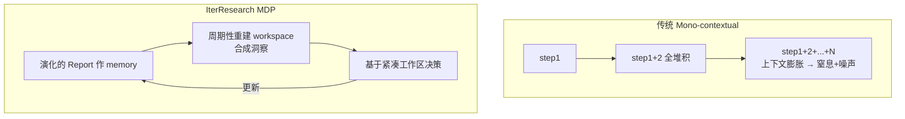

# IterResearch — 用 Markovian 状态重建解决长程 Deep Research 的上下文膨胀

> **arXiv**：2511.07327（2025.11，ICLR 2026）｜**机构**：阿里 Tongyi Lab（Xin Zhao / Pengjun Xie / Jingren Zhou 等）｜**HF 月榜**：2025-11 #36，80↑
> **关键词**：Long-Horizon DR · Markovian / MDP · Workspace Reconstruction · EAPO · Interaction Scaling

---

## 1. 这篇论文为什么重要

**一句话**：IterResearch 诊断出 deep research agent 的"**mono-contextual 范式**"——把所有信息堆进一个不断膨胀的上下文——会导致"context 窒息 + 噪声污染"，并用 **MDP 思路周期性重建 workspace + 演化 report 作 memory** 来解决，6 个基准平均 +14.5pp。

为什么重要：

- 长程 deep research（几十到上千步）里，**单一膨胀上下文**是核心瓶颈：信息越堆越多 → 模型注意力被稀释（窒息）+ 早期噪声污染后期推理。
- IterResearch 把它**重新形式化为 MDP**——每一步基于"重建后的紧凑工作区"决策，而非"线性累积的全部历史"。这让推理能力**在任意探索深度都保持一致**。
- 配套的 **EAPO**（Efficiency-Aware Policy Optimization）用几何奖励折扣激励高效探索——是把"上下文管理"和"RL 训练"协同设计的代表。
- 来自阿里通义实验室（Tongyi DeepResearch 系，本库另有 `tongyi-deepresearch/` 专题），是开源 DR 长程能力的关键基建，ICLR 2026 收录。

---

## 2. 核心方法

### 2.1 Mono-contextual vs IterResearch

### 2.2 Markovian 状态重建（核心）

- 不做"线性上下文累积"，而是**周期性重建工作区**——每隔若干步把已有信息**合成为洞察**，丢弃冗余原始内容；
- 维护一份**演化的 report 作为 memory**——它是被不断提炼的状态，而非全部历史的堆叠；
- 这本质是把长程任务**Markov 化**：当前决策只依赖"重建后的紧凑状态"，保证**任意探索深度下推理能力一致**（不随步数增长而退化）。

### 2.3 EAPO（Efficiency-Aware Policy Optimization）

训练侧与上下文管理协同：

- **几何奖励折扣**——激励 agent 高效探索（早找到答案的轨迹奖励更高），抑制无意义的长尾游走；
- **自适应下采样**——稳定分布式训练（不同长度轨迹的训练稳定性）。

### 2.4 Interaction Scaling

- 把"扩展"从"更大模型/更长上下文"转向"**更多交互步数**"——周期性重建让交互可扩展到 **2048 步**而不崩。

---

## 3. 关键实验结果

| 指标 | 结果 |
| --- | --- |
| 6 个基准平均（vs 开源 agent） | **+14.5pp** |
| 交互可扩展深度 | 最高 **2048 步** |
| 扩展带来的性能增益 | **3.5% → 42.5%** |
| 作为 prompting 策略（vs ReAct） | 最高 **+19.2pp** |

- 既能作为**训练范式**（EAPO），也能作为**纯 prompting 策略**（周期性重建）单独使用——后者就比 ReAct 高 19.2pp。

---

## 4. 对领域的影响 / 后续方向

### 🌟 影响

- 把长程 DR 的核心痛点（mono-context 膨胀）**形式化为 MDP 问题**，给出"周期性重建 + 演化 report"的系统解法——是长程 agent 上下文管理的代表工作。
- **EAPO** 把"高效探索"做进奖励设计——与 GrandCode 的难度自适应长度惩罚（`huggingface/01`）同属"用奖励塑形控制 agent 行为长度"。

### ⚠ 局限

- **重建/合成的信息损失**风险——若提炼洞察时丢掉了后期才有用的细节，会影响答案（与 DreamGym 经验模型保真度问题同类）；
- 重建频率/粒度是需要调的超参，不同任务最优点不同。

### 🔮 趋势

1. 与 **Harness-1**（[[13-harness-1]]）形成"上下文/状态管理"的两条路：IterResearch 让 **policy 周期性重建**，Harness-1 把**状态外置给 harness**——都在回答"长程 agent 的状态该放哪、谁来管"。
2. 与 `huggingface/` 的 Observation-Masking（陈旧观察掩码）、SWE-Pruner（上下文裁剪）共同构成"长程 agent context engineering"主题。
3. 作为"深度扩展"的代表，与 **WideSeek-R1**（[[10-wideseek-r1]]，宽度扩展）形成 DR scaling 的双维坐标。

---

## 5. 资源

- **arXiv**：https://arxiv.org/abs/2511.07327
- **HF Papers**：https://huggingface.co/papers/2511.07327
- **作者**：Guoxin Chen, Zile Qiao, … Wayne Xin Zhao, Ruihua Song, Pengjun Xie, Fei Huang, Jingren Zhou（阿里 Tongyi Lab，16 作者）
- **GitHub**：https://github.com/Chen-GX/IterResearch
- **相关**：本库 `tongyi-deepresearch/` 通义 DeepResearch 系列专题
