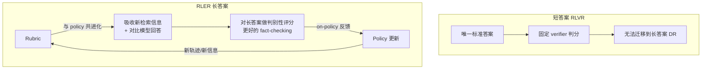

# DR Tulu — 演化式 Rubric 奖励，把 RL 推到长答案 Deep Research

> **arXiv**：2511.19399（2025.11，ICML 2026）｜**机构**：AI2 / UW（Hannaneh Hajishirzi / Pang Wei Koh / Luke Zettlemoyer 等）｜**HF 月榜**：2025-11 #47，63↑
> **关键词**：RLER · Evolving Rubrics · Long-Form Deep Research · Verifiable Reward · DR Tulu-8B

---

## 1. 这篇论文为什么重要

**一句话**：DR Tulu 用 **RLER（RL with Evolving Rubrics）** 解决"长答案 deep research 无法验证"的难题——让评分 rubric **与 policy 共进化**，提供有判别力的 on-policy 反馈，DR Tulu-8B 超 Tongyi DR 平均 +15.6%、与 OpenAI DR 持平但**便宜 1000×**。

为什么重要：

- 多数开源 DR 模型在**易验证的短答案 QA** 上用 RLVR 训练（答案唯一、好判分）。但这**无法迁移**到真实 DR 任务——后者要产出**长篇、有引用、多源**的答案，没有唯一标准答案，**无法用固定 verifier 判分**。
- DR Tulu 的破法：**rubric 不固定**——它**与 policy 一起进化**，不断吸收"新检索到的信息 + 对比模型回答"，从而对**长答案做更细、更有判别力的评分**。
- 这是对"可验证奖励从哪来"的关键回答——当答案不可验证时，**让评分标准本身在训练中长出来**。
- 来自 AI2 + UW（Tulu 系列出品方，OLMo/Tulu 开源标杆），ICML 2026 收录，是开源 DR RL 的代表性工作。

---

## 2. 核心方法

### 2.1 短答案 RLVR vs RLER

### 2.2 RLER：演化式 Rubric（核心）

- **rubric（评分细则）在训练中被构建并持续维护，与 policy model 共进化**；
- 演化方式：rubric 不断**吸收"从搜索新探索到的信息" + "对比不同模型回答"** 得到的洞察——即评分标准随着 agent 见到更多证据而变得更精细、更有区分度；
- 好处：① 支持更好的 **fact-checking**（rubric 知道哪些事实该被核查）；② 提供更 **discriminative 的 on-policy 反馈**（能区分"看似对"和"真的对"的长答案）。

### 2.3 为什么共进化是关键

- 固定 rubric 在长答案上很快"过时"——agent 探索出新信息后，旧 rubric 评不准；
- 让 rubric 跟着 policy 与新证据一起长，保证奖励信号**始终贴合当前任务的真实质量维度**——这与 `huggingface/00` W03 DeepResearchEval 的"Adaptive 评估 + Active Fact-Checking"思路同源，但 DR Tulu 把它做进了**训练奖励**而非只做评测。

---

## 3. 关键实验结果

在科学/医疗/通用领域的 **4 个长答案 DR 基准**：

| 对比 | 结果 |
| --- | --- |
| vs Tongyi DR（平均） | **+15.6%** |
| vs OpenAI DR（平均） | **+0.7%**（持平/略超闭源） |
| 每 query 成本 | 比 OpenAI DR **便宜 1000×** |

- **8B 模型与 OpenAI DR 持平**，且成本低三个数量级——开源 DR 性价比的标杆。

---

## 4. 对领域的影响 / 后续方向

### 🌟 影响

- 回答了 DR RL 的核心难题——"**长答案不可验证时奖励从哪来**"——用演化 rubric 把"可验证性"从"固定 verifier"扩展到"**会成长的评分标准**"。
- 提供完整开源（DR Tulu-8B + 训练），是 OSS deep research 生态的关键一块（与 `huggingface/` OpenResearcher、`tongyi-deepresearch/` 互补）。

### ⚠ 局限

- 演化 rubric 的**质量依赖"对比模型回答"的强度**——若对比对象弱，rubric 长歪；
- rubric 演化本身可能引入不稳定（评分标准变化太快会让 RL 信号抖动），需谨慎控制演化速度。

### 🔮 趋势

1. 与 **ERL**（[[02-experiential-rl]]，反思）、**OpenClaw-RL**（[[03-openclaw-rl]]，next-state hindsight）一道，是"**奖励/监督信号丰富化**"的不同切面——DR Tulu 占据"**演化评分标准**"这一路。
2. 与 GrandCode（测试用例验证）、CUDA Agent（性能 profiling [[07-cuda-agent]]）形成"可验证奖励"光谱——从"客观可测"到"标准需成长"。
3. "演化 rubric"可与 cross-model verification（`huggingface/07` ARIS）结合——用不同模型族交叉生成/校验 rubric，降低自洽偏差。

---

## 5. 资源

- **arXiv**：https://arxiv.org/abs/2511.19399
- **HF Papers**：https://huggingface.co/papers/2511.19399
- **作者**：Rulin Shao, Akari Asai, … Luke Zettlemoyer, Yoon Kim, Hannaneh Hajishirzi, Pang Wei Koh（AI2 / UW，21 作者）
- **GitHub**：https://github.com/rlresearch/dr-tulu
