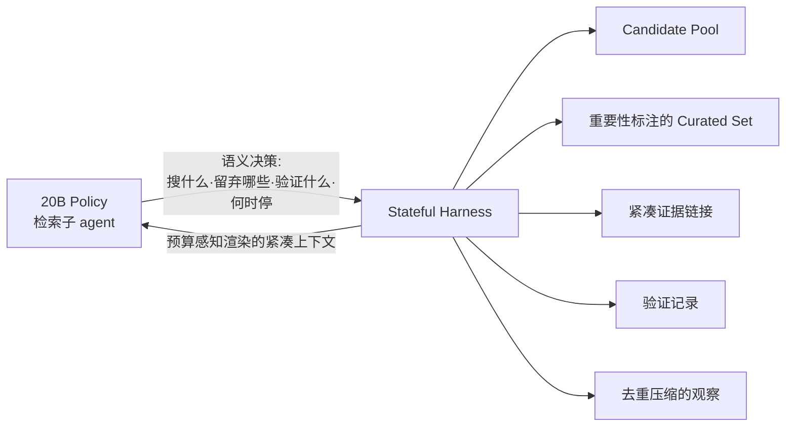

# Harness-1 — 把状态管理外置到 Harness，让 RL 只学语义决策

> **arXiv**：2606.02373（2026.06）｜**机构**：UIUC（Jiawei Han 组）/ Chroma（Pengcheng Jiang / Jimeng Sun 等）｜**HF 月榜**：2026-06 #45，52↑
> **关键词**：State-Externalizing Harness · Search Agent RL · Environment-Side Working Memory · Harness Engineering

---

## 1. 这篇论文为什么重要

**一句话**：Harness-1 主张——把搜索 agent 训成"transcript 上的 policy"会逼模型**同时**优化"语义检索决策"和"琐碎的状态记账"，浪费 RL；解法是**把状态管理外置给一个有状态的 harness**，让 20B policy **只学语义决策**，8 个检索基准 curated recall 0.730、比次强开源 +11.4。

为什么重要：

- 主流搜索 agent 把整条增长的 transcript 当 policy 输入——模型既要决定"怎么搜"，又要在脑子里**记住**"看过什么、哪些证据有用、哪些约束还没满足、哪些 claim 已核查"。
- Harness-1 的洞察：这些**记账（bookkeeping）是可恢复的、环境能更可靠维护的**——不该让 RL 去优化它。**RL 应专注于真正的语义选择**。
- 这是 **harness engineering**（`huggingface/20` Code as Agent Harness 命名的新主题）的精确实证：**RL 该优化什么、不该优化什么，取决于 harness 怎么切分职责**。
- 来自 UIUC Jiawei Han 组 + Chroma（向量数据库公司），把"agent 工程"与"RL 训练"的边界划清，是 2026 H1 harness×RL 的代表。

---

## 2. 核心方法

### 2.1 状态外置架构

### 2.2 Harness 维护的环境侧 working memory

把这些**可恢复的状态**从 policy 里搬到 harness：

- **candidate pool**（候选池）；
- **importance-tagged curated set**（重要性标注的精选集）；
- **compact evidence links**（紧凑证据链接）；
- **verification records**（验证记录——哪些 claim 已核查）；
- **compressed & deduplicated observations**（去重压缩的观察）；
- **budget-aware context rendering**（预算感知的上下文渲染——按 token 预算决定给 policy 看什么）。

### 2.3 Policy 只保留语义决策

模型只负责**真正需要智能**的选择：

- **搜什么**（what to search）；
- **留哪些 / 弃哪些文档**（which to keep or discard）；
- **验证什么**（what to verify）；
- **何时停**（when to stop）。

> **核心论点**：RL 否则会被迫**同时**优化"语义检索决策"和"可恢复的记账"。把后者外置，RL 就能集中火力在前者——**职责分离让 RL 更高效、更易泛化**。

---

## 3. 关键实验结果

在覆盖 web / 金融 / 专利 / multi-hop QA 的 **8 个检索基准**：

| 指标 | 数值 |
| --- | --- |
| 平均 curated recall | **0.730** |
| vs 次强开源 search subagent | **+11.4** 分 |
| vs 更大的 frontier 模型检索器 | 有竞争力 |
| held-out 迁移基准 | **增益尤其大**（泛化好） |

- 在**没见过的迁移基准**上增益最大——说明"语义决策"比"记账"更可迁移（记账是任务特定的，语义能力是通用的）。

---

## 4. 对领域的影响 / 后续方向

### 🌟 影响

- 给 **harness engineering** 提供精确实证——**好的职责切分能让 RL 事半功倍**。这是对"系统级设计与权重训练同等重要"（`huggingface/20`）的有力佐证。
- 提出一个可操作的设计原则：**把"可恢复的状态"外置，只让 RL 优化"不可恢复的语义决策"**——对所有长程 agent（不只搜索）有借鉴意义。

### ⚠ 局限

- 需要**为每类任务设计 harness 的状态结构**（candidate pool / curated set 等）——harness 本身是工程成本，且不同任务的最优 working memory 结构不同；
- "什么是可恢复的记账 vs 真正的语义决策"的边界，在某些任务里并不清晰。

### 🔮 趋势

1. 与 **LLM-in-Sandbox**（[[04-llm-in-sandbox]]）形成"环境职责切分"的两极：LLM-in-Sandbox 把环境**做薄**（模型自由发挥），Harness-1 把环境**做厚**（外置状态）——共同说明 RL 优化目标由环境设计决定。
2. 与 **IterResearch**（[[11-iterresearch]]）的"policy 周期性重建 workspace"是同一问题（长程状态管理）的两条路：一个让 policy 管、一个让 harness 管。
3. 把 harness engineering 与 RL 训练联合设计，是 `huggingface/20` Code as Agent Harness、`huggingface/07` ARIS 之后 harness×RL 方向的自然延伸。

---

## 5. 资源

- **arXiv**：https://arxiv.org/abs/2606.02373
- **HF Papers**：https://huggingface.co/papers/2606.02373
- **作者**：Pengcheng Jiang, Zhiyi Shi, Kelly Hong, Xueqiang Xu, Jiashuo Sun, Jimeng Sun, Hammad Bashir, Jiawei Han（UIUC / Chroma）
- **GitHub**：https://github.com/pat-jj/harness-1
