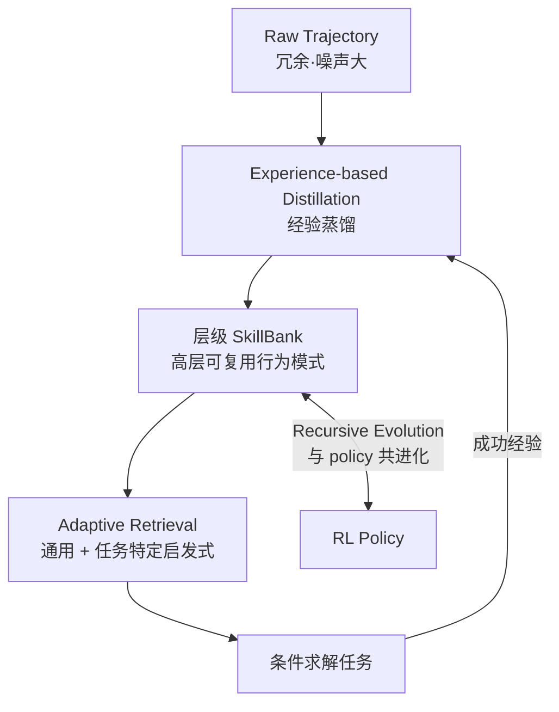

# SkillRL — 递归技能增强强化学习（连接 raw experience 与 policy）

> **arXiv**：2602.08234（2026.02）｜**机构**：UNC-Chapel Hill（Huaxiu Yao 组，aiming-lab）｜**HF 月榜**：2026-02 #42，76↑
> **关键词**：Skill Discovery · Recursive Evolution · SkillBank · Skill-Augmented RL

---

## 1. 这篇论文为什么重要

**一句话**：SkillRL 把"原始经验"与"policy 改进"之间架了一座桥——用**自动技能发现 + 递归进化**把冗余的 raw trajectory 提炼成**层级 SkillBank**，并让技能库**与 policy 在 RL 中共进化**，ALFWorld/WebShop + 7 个搜索任务超强基线 +15.3%。

为什么重要：

- LLM agent 常**孤立运作、不从过去经验学习**。已有 memory-based 方法主要**存 raw trajectory**——冗余且噪声大，agent 提不出"高层、可复用的行为模式"，泛化受限。
- SkillRL 的破法：不存原始轨迹，而是**把成功经验蒸馏成结构化 skill**，建层级库，并用**递归进化**让库随 policy 一起成长。
- 关键区别于"inference-time skill 检索"——SkillRL 让**skill 库与 policy 在 RL 训练中耦合演化**（而非训练后挂一个静态库）。
- 来自 UNC Huaxiu Yao 组（同组有 Agent0 [[05-agent0]]、MetaClaw），是"skill × RL"方向的代表，与 SKILL0（[[15-skill0]]）形成"技能库进化 vs 技能内化"的对位。

---

## 2. 核心方法

### 2.1 从 raw experience 到 policy 改进

### 2.2 三大机制

| 机制 | 作用 |
| --- | --- |
| **Experience-based Distillation** | 把成功的 raw experience **蒸馏**成结构化 skill，构建**层级 SkillBank**（解决 raw trajectory 冗余噪声问题） |
| **Adaptive Retrieval** | 自适应检索策略，区分**通用启发式**与**任务特定启发式**——按需取用 |
| **Recursive Evolution** | 让 SkillBank **与 agent policy 在 RL 中共进化**——库不是静态的，随 policy 能力提升而递归扩展/精炼 |

### 2.3 为什么"共进化"是关键

- 静态 skill 库（训练后挂上去）很快与 policy 脱节——policy 进步了，旧 skill 可能过时或冗余；
- SkillRL 让**库与 policy 同步演化**：成功轨迹 → 蒸馏新 skill → 进库 → 帮 policy 解更难任务 → 又产生新成功轨迹……形成递归飞轮；
- 这降低了 token 足迹（结构化 skill 比 raw trajectory 紧凑）同时提升推理效用。

---

## 3. 关键实验结果

| 基准 | 结果 |
| --- | --- |
| ALFWorld + WebShop + 7 个搜索增强任务 | 超强基线 **+15.3%** |
| 任务复杂度上升时 | 鲁棒性**保持**（不随难度崩） |

- 在长程任务上一致 SOTA，且复杂度越高优势越稳——印证"可复用 skill 对长程泛化的价值"。

---

## 4. 对领域的影响 / 后续方向

### 🌟 影响

- 解决 memory-based agent 的核心痛点——**raw trajectory 冗余、提不出可复用模式**——用"蒸馏成 skill + 递归进化"替代"存原始轨迹"。
- **库与 policy 共进化**是关键设计——避免静态 skill 库与 policy 脱节，是"skill learning"工程化的重要一步。

### ⚠ 局限

- 技能蒸馏的质量依赖"成功经验"的判定——若奖励信号噪声大，会蒸馏出坏 skill（与 `huggingface/17` SkillsBench"self-generated skill 平均无收益"的隐忧相关，需 validation gate）；
- 层级 SkillBank 的检索/组织随库膨胀的可扩展性需关注。

### 🔮 趋势

1. 与 **SKILL0**（[[15-skill0]]）形成"skill × RL"两条路：SkillRL **维护并进化外部技能库**，SKILL0 **把技能内化进参数**——库 vs 权重。
2. 与 `huggingface/` 的 Skill1（统一 selection/utilization/distillation）、SkillClaw（生态级集体进化）、SkillOpt（text-space SGD）构成完整 skill 谱系。
3. 与同组 **Agent0**（[[05-agent0]]，能力共进化）一脉——从"能力共进化"到"技能库共进化"，UNC aiming-lab 的自演化 agent 系列。

---

## 5. 资源

- **arXiv**：https://arxiv.org/abs/2602.08234
- **HF Papers**：https://huggingface.co/papers/2602.08234
- **作者**：Peng Xia, Jianwen Chen, … Cihang Xie, Huaxiu Yao（UNC 等）
- **GitHub**：https://github.com/aiming-lab/SkillRL
