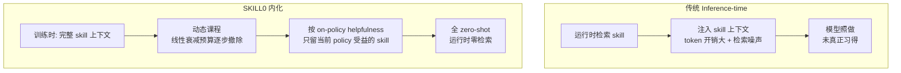

# SKILL0 — In-Context Agentic RL 把技能内化进模型参数

> **arXiv**：2604.02268（2026.04）｜**机构**：浙江大学（Yongliang Shen / Weiming Lu 等，ZJU-REAL）｜**HF 月榜**：2026-04 #39，101↑
> **关键词**：Skill Internalization · In-Context RL · Zero-Shot · Dynamic Curriculum · No Runtime Retrieval

---

## 1. 这篇论文为什么重要

**一句话**：SKILL0 质疑"inference-time skill 检索"的根本局限（检索噪声 + token 开销 + 模型只"照做"未真正习得），提出用 **in-context RL 把 skill 内化进参数**，训练时逐步撤除 skill 上下文直到 **zero-shot**——ALFWorld +9.7% / Search-QA +6.6% / WebShop +10.1%，每步 <0.5k token。

为什么重要：

- agent skill（推理时动态加载的"过程知识 + 可执行资源"包）已成 augment LLM agent 的可靠手段。但**inference-time 加载有三大硬伤**：① 检索噪声引入无关指导；② 注入的 skill 内容**占大量 token**；③ 模型**从未真正习得**知识——只是"照着做"。
- SKILL0 的破法：**把 skill 训进权重**——让模型 zero-shot 自主行动，**运行时完全不检索 skill**。
- 关键机制是**动态课程**——训练时从"完整 skill 上下文"**逐步撤除**到"全 zero-shot"，并按"on-policy helpfulness"只保留当前 policy 仍受益的 skill。
- 来自浙大 ZJU-REAL，与 SkillRL（[[14-skillrl]]）形成"技能库进化 vs 技能内化"的精确对位，是"skill × RL"方向的代表。

---

## 2. 核心方法

### 2.1 Inference-time 检索 vs SKILL0 内化

### 2.2 In-Context RL 内化机制

- **训练课程**：从**完整 skill 上下文**开始，然后**逐步撤除**它；
- skill 被**离线按类别分组**，与交互历史一起**渲染成紧凑视觉上下文**，教模型工具调用 + 多轮任务完成；
- 目标：让模型把 skill 知识**baked into 权重**，实现**零运行时检索的 zero-shot 自主行为**。

### 2.3 动态课程（消除运行时检索的关键）

- 评估**每个 skill 文件的 on-policy helpfulness**——当前 policy 还从哪些 skill 受益？
- 在**线性衰减的预算**内，只保留仍有帮助的 skill 文件，逐步减少，**直到 agent 完全 zero-shot 运作**；
- 这是一个优雅的"扶上马、送一程、再放手"机制——训练初期给足 skill 上下文，随能力提升逐步撤掉，最终内化完成。

---

## 3. 关键实验结果

相对标准 RL 基线的提升：

| 基准 | 提升 |
| --- | --- |
| ALFWorld | **+9.7%** |
| Search-QA | **+6.6%** |
| WebShop | **+10.1%** |

- **上下文效率**：每步 **<0.5k token**——相比 inference-time 注入 skill（动辄数 k token），开销大幅降低；
- 内化后 **zero-shot 运行**，无检索延迟与噪声。

---

## 4. 对领域的影响 / 后续方向

### 🌟 影响

- 把 skill 从**inference-time 外挂**转为**parameter 内化**——同时解决检索噪声、token 开销、"只照做未习得"三大问题，是 skill engineering 的范式选择。
- **动态课程（逐步撤除 skill 上下文）** 是一个可复用的"知识内化"训练技巧——不止 skill，任何"先给提示再撤除"的能力内化都可借鉴（呼应 `huggingface/00` W16 KnowRL 的"最小充分 hint"思路）。

### ⚠ 局限

- 内化是**任务族特定**的——内化了 ALFWorld 的 skill 不代表能 zero-shot 做全新领域；新领域仍需重新内化（vs 外部库可即时增删 skill 的灵活性）；
- "撤除 skill 上下文"的速度/课程是超参，撤太快会学不到、太慢则训练低效。

### 🔮 趋势

1. 与 **SkillRL**（[[14-skillrl]]）形成"skill × RL"两条路——**库（外部、可增删、共进化）vs 内化（参数、zero-shot、无检索）**，各有适用场景。
2. 与 `huggingface/17` SkillsBench 实证呼应——SkillsBench 揭示"self-generated skill 平均无收益、curated skill 才有效"，SKILL0 则把 curated skill **内化**进参数，是"如何更好用 skill"的训练侧答案。
3. "能力内化"（撤除外部支架）与 ERL（[[02-experiential-rl]]，反思内化）、Experiential RL 的"成果固化到权重、部署零开销"哲学一致——都是把推理时的辅助转为训练时的内化。

---

## 5. 资源

- **arXiv**：https://arxiv.org/abs/2604.02268
- **HF Papers**：https://huggingface.co/papers/2604.02268
- **作者**：Zhengxi Lu, Zhiyuan Yao, Jinyang Wu, … Weiming Lu, Jun Xiao, Yueting Zhuang, Yongliang Shen（浙江大学 ZJU-REAL 等）
- **GitHub**：https://github.com/ZJU-REAL/SkillZero
