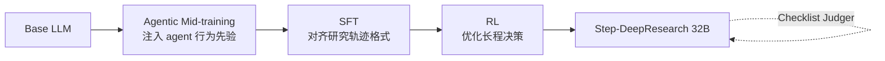

# Step-DeepResearch — 中等规模模型靠精细化训练逼平闭源 DeepResearch

> **arXiv**：2512.20491（2025.12）｜**机构**：StepFun（阶跃星辰）
> **HF 月榜**：2025-12 月榜 #32，88↑
> **关键词**：Atomic Capabilities · Agentic Mid-training · Checklist Judger · ADR-Bench
> **GitHub**：[stepfun-ai/StepDeepResearch](https://github.com/stepfun-ai/StepDeepResearch)（560★）

---

## 1. 这篇论文为什么重要

**一句话**：Step-DeepResearch 证明 **「中等规模模型（32B）+ 精细化训练流水线」可以在真实开放式研究任务上达到专家级能力，且成本远低于闭源系统**——核心抓手是 **基于 Atomic Capabilities（原子能力）的数据合成** + **渐进式三段训练** + **Checklist-style Judger**。

为什么这是 deep research 的关键进展：

- 学术基准（如 BrowseComp）只考"找到一个可验证短答案"，但 **真实开放式研究**需要的是 **intent recognition（意图识别）、long-horizon decision-making（长程决策）、cross-source verification（跨源验证）** 三种能力，benchmark 与现实严重脱节。
- 这与 [[05-openseeker]]、[[06-openresearcher]] 同属 **「以数据为中心、全开源」的 DR 路线**——但 Step 的独特点在于 **把「能力」拆成可单独强化的原子单元**，再用数据合成定向补强 planning 与 report writing 两个最弱环节。
- 其 **agentic mid-training → SFT → RL** 的渐进路径，与 [[01-mirothinker-v1]] 的「先做 agentic 中段训练再 RL」一脉相承——共同印证 **base LLM 不能直接当 agent，需要一个 agent 专属的中段训练阶段**。

---

## 2. 核心方法

### 2.1 三大组件

| 组件 | 作用 | 解决的痛点 |
| --- | --- | --- |
| **Atomic Capabilities 数据合成** | 把研究能力拆成原子单元，定向合成数据强化 **planning** 与 **report writing** | 开放式研究中规划与成文是最薄弱环节 |
| **渐进式训练路径** | **Agentic Mid-training → SFT → RL** 三段递进 | base LLM 无 agent 先验，直接 RL 不稳定 |
| **Checklist-style Judger** | 清单式评判器对中间步骤/最终报告逐项核查 | 显著提升 robustness（鲁棒性） |

### 2.2 为什么用「原子能力」做数据合成

开放式研究是复合能力。若直接合成「整段研究轨迹」，模型很难学到其中**哪一步**是关键。Step 的思路是：

$$\text{Open-ended Research} = \sum_i \text{Atomic Capability}_i \;(\text{planning, verification, report writing}, \dots)$$

→ 对每个原子能力单独合成强化数据，再组合训练，使 planning 与 report writing 这两个公认短板被**定向补齐**。

### 2.3 渐进式三段训练

### 2.4 ADR-Bench

为填补**中文 deep research 评测空白**，作者建立 **ADR-Bench**（真实中文深度研究场景），用于在中文域做可信评估——对应了国内 DR 缺乏高质量开放式中文评测的现状。

---

## 3. 关键实验结果

| 评测 | Step-DeepResearch (32B) | 说明 |
| --- | --- | --- |
| **Scale AI Research Rubrics** | **61.4%** | 评分制开放式研究评测 |
| **ADR-Bench（中文）** | 大幅超过同级模型，**匹敌 OpenAI / Gemini DeepResearch** | 摘要未披露具体分值，需读 PDF |

核心结论：**refined training（精细化训练）让中等规模模型以业界领先的性价比达到专家级能力**——这正是对「DR 必须靠超大模型 + 海量算力」的直接反驳。

> 注：除 61.4% 外，ADR-Bench 上对 OpenAI/Gemini 的具体数值对比摘要未披露，需读 PDF。

---

## 4. 对领域的影响 / 后续方向

### 学界影响

1. **「能力拆原子 + 定向合成」成为数据中心化 DR 的新范式**
   - 不再盲目合成整段轨迹，而是先诊断短板（planning / report writing）再定向补强。
2. **Agentic mid-training 阶段进一步被确立**
   - 与 [[01-mirothinker-v1]] 共同推动 pretraining → **agentic mid-training** → SFT → RL 的四段式。
3. **填补中文 DR 评测空白**
   - ADR-Bench 与 [[04-step-deepresearch]] 自身形成「方法 + 中文基准」配对，对照英文域的 BrowseComp。

### 局限

- 摘要只给出 Scale AI Research Rubrics 的 61.4%，ADR-Bench 的具体数字与对手分值未披露。
- Checklist Judger 的实现（prompt 模板？规则？训练分类器？）摘要未展开。
- Atomic Capabilities 的具体清单与各自数据量未量化。

### 揭示的趋势

1. **「中等模型 + 精细训练」对抗「超大模型 + 暴力算力」**——成本效率成为 DR 竞争的新主轴。
2. **Judger 内化为训练信号**——清单式核查与 [[03-dr-tulu]] 的 evolving rubric 同属「把评测标准嵌入训练」的方向。
3. **中文 DR 评测起步**——ADR-Bench 之于中文，类似 BrowseComp-ZH 的延伸。

### 同方向工作

- [[05-openseeker]]：全开源 search agent，同样以数据合成（逆向 web graph）撬动 SOTA。
- [[06-openresearcher]]：全开源 DR 轨迹合成 pipeline，离线语料 + 轨迹蒸馏。
- [[01-mirothinker-v1]]：interaction scaling + agentic mid-training 的奠基工作。
- [[03-dr-tulu]]：RLER 把 rubric 嵌入训练，与 Checklist Judger 理念相通。

---

## 5. 资源

- **arXiv**：https://arxiv.org/abs/2512.20491
- **HF Papers**：https://huggingface.co/papers/2512.20491（88↑）
- **GitHub**：https://github.com/stepfun-ai/StepDeepResearch（560★）
- **机构**：StepFun（阶跃星辰）
- **配套基准**：ADR-Bench（中文 deep research 评测）
- **模型规模**：32B
