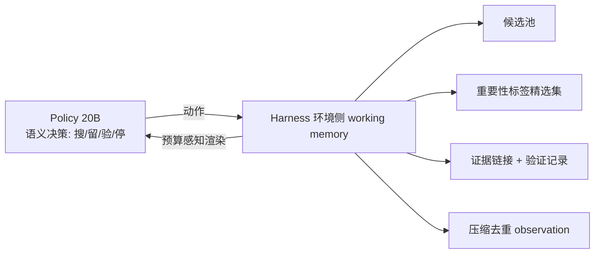

# State Externalization & 训练踩坑 — 怎样把搜索 agent「训好 + 管好状态」

> **论文一（主）**：Harness-1，arXiv 2606.02373（2026.06）｜**机构**：Chroma（chromadb）｜**HF 月榜**：2026-06 月榜 #45，52↑｜**关键词**：State-Externalizing Harness · Working Memory · Curated Recall · RL Search Agent｜**GitHub**：[pat-jj/harness-1](https://github.com/pat-jj/harness-1)（548★）
>
> **论文二**：FORT-Searcher，arXiv 2606.12087（2026.06）｜**机构**：RUC AIBox（中国人民大学）｜**HF 月榜**：2026-06 月榜 #22，68↑｜**关键词**：Shortcut-Aware Difficulty · Shortcut Risks · Trajectory Signatures · SFT-only｜**GitHub**：[RUCAIBox/FORT-Searcher](https://github.com/RUCAIBox/FORT-Searcher)
>
> **论文三**：Masking Stale Observations，arXiv 2606.00408（2026.06）｜**机构**：McAuley-Lab｜**HF 月榜**：2026-06 月榜 #28，62↑｜**关键词**：Observation Masking · Context Management · Regime Map · Token-for-Turn Trade-off｜**GitHub**：[i-DeepSearch/observation-masking](https://github.com/i-DeepSearch/observation-masking)（16★）

---

## 1. 这篇论文为什么重要

**一句话**：这三篇 2026-06 的工作从三个互补角度回答同一个问题——「怎样把搜索 agent **训好、同时正确地管理它的状态/上下文**」：**Harness-1 把状态外化到环境侧**，**FORT-Searcher 修掉训练数据里的捷径**，**Masking 证明上下文管理没有银弹（regime-dependent）**。

为什么三者放在一起读最有价值：

- **Harness-1（怎么管状态）**：主流做法把搜索 agent 训练成「在不断增长的 transcript 上的 policy」——模型既要决定「怎么搜」，又要记住「看过什么、哪些证据有用、哪些约束还没满足、哪些声明已被核实」。Harness-1 主张这把**太多 routine 状态管理塞进了 policy**，RL 被迫同时优化「语义搜索决策」和「环境本可更可靠维护的可恢复簿记」。解法是把 working memory **外化到环境侧**。这与 [[02-iterresearch]] 的「演进报告当记忆」、[[11-general-agentic-memory]] 的 memorizer/researcher 框架同属一脉：**把状态从 policy 的 transcript 里搬出来**。
- **FORT-Searcher（怎么造训练数据）**：训练深度搜索 agent 需要「在搜到足够证据前答案不可得」的可验证问题。但既有合成方法靠**堆图结构**提升表观难度，而结构复杂 ≠ 真实搜索难度——预期的搜索过程可能被一条**更便宜的识别捷径**绕过。FORT 把这一缺口形式化为「捷径感知难度框架」。
- **Masking（怎么管上下文）**：长程搜索 agent 跨大量 tool call 累积检索内容，最朴素的干预是「把过期 observation 从上下文里 mask 掉」。但这篇做了 4B–284B backbone × 3 retriever 的系统扫描，发现增益呈**非对称倒 U 形**——没有放之四海皆准的结论。这是对 [[02-iterresearch]]「主动遗忘/重构上下文」乐观主张的一次**冷静校准**。

三者共同把「搜索 agent 工程学」从「调 prompt」推向「**状态外化 + 数据去捷径 + 上下文管理分区制**」——与 [[code-as-harness]] 的 harness engineering 思路同向：**agent 的能力不只在权重里，更在它所处的 harness/环境设计里**。

---

## 2. 核心方法

### 2.1 Harness-1：状态外化的 harness（State-Externalizing Harness）

Harness-1 是一个 **20B 搜索 agent（检索 subagent）**，用 RL 训练，但训练发生在一个**有状态的搜索 harness 内部**。核心是**职责切分**：

| 角色 | 负责什么 |
| --- | --- |
| **Harness（环境侧 working memory）** | 候选池（candidate pool）、带重要性标签的精选集（importance-tagged curated set）、紧凑证据链接（compact evidence links）、验证记录（verification records）、压缩去重后的 observation、预算感知的上下文渲染（budget-aware context rendering） |
| **Policy（模型侧语义决策）** | 搜什么、保留/丢弃哪些文档、核实什么、何时停止 |

核心论点：**RL 不应被迫去优化「可恢复的簿记」**——这些状态环境能维护得更可靠。把它们外化后，RL 只需优化真正需要学习的**语义决策**。

直觉：传统做法里「记什么、怎么压缩历史」全靠模型在 transcript 里自己扛；Harness-1 把这部分变成**环境提供的服务**，模型只做不可外包的语义判断。其评测指标 **curated recall**（精选集召回）正对应「policy 决定保留下来的证据有多全」。

### 2.2 FORT-Searcher：捷径抗性的训练数据合成（FORT）

**第一步——诊断**。形式化「捷径感知难度框架」，识别 **4 类可操作的捷径风险**：

| 捷径风险 | 含义 |
| --- | --- |
| **Evidence co-coverage**（证据共覆盖） | 多个线索被同一来源一并覆盖，无需多跳搜索 |
| **Single-clue selectivity**（单线索选择性） | 单个线索就能高选择性地锁定答案 |
| **Exposed constants**（暴露常量） | 问题里直接暴露了可识别的常量 |
| **Prior-knowledge binding**（先验知识绑定） | 答案可被模型内部先验知识直接绑定 |

**第二步——用轨迹签名（trajectory signatures）诊断「实际」效果**：

| 轨迹签名 | 度量什么 |
| --- | --- |
| **Solving cost**（求解成本） | 解题实际花的代价 |
| **Answer hit time**（答案命中时刻） | 答案在轨迹中何时被命中 |
| **Prior-shortcut rate**（先验捷径率） | 靠先验/捷径直接得解的比例 |

**第三步——FORT 框架施加控制**。FORT（Framework of Shortcut-Resistant Training-Data Synthesis）在四个环节控制捷径风险：**实体选择（entity selection）→ 证据图构建（evidence graph construction）→ 问题表述（question formulation）→ 对抗式精炼（adversarial refinement）**。

效果：FORT 数据相比既有开源深度搜索数据集，**诱导出更长的答案前搜索、更少的捷径模式**。最终用这些轨迹**仅靠 SFT** 训出 FORT-Searcher。

### 2.3 Masking Stale Observations：上下文管理的「分区图」（Regime Map）

最小干预：随轨迹推进，把**过期 observation** 从上下文里 mask 掉。问题是「何时有用、为什么」。作者做了系统扫描：

- **变量**：agent backbone 从 **4B 到 284B**；**3 种 retriever**；离线 + 实时 web 两类基准。
- **核心发现**：把「masking 带来的准确率增益」对「不做上下文管理时模型的准确率」作图，呈 **非对称倒 U 形（asymmetric inverted-U）**：

| Regime（区制） | 现象 |
| --- | --- |
| **弱 retriever** | 增益 **plateau（平台）**——召回本就不足，mask 帮不上 |
| **强 retriever × 中等容量模型** | 增益**峰值（peak）**——此时 masking 收益最大 |
| **模型已饱和** | 增益**急剧崩塌（sharp collapse）**——mask 反而删掉模型本会用到的证据 |

**机制——token-for-turn 权衡（token-for-turn trade-off）**：masking 删掉模型基本已不再 attend 的 observation（agent 很少会再翻回去的「页」），把省下的 token 换成更多 turn。

$$\text{masking 净收益} \;=\; \underbrace{(\text{多出的 turn 把失败转成成功})}_{\text{收益}} \;-\; \underbrace{(\text{mask 删掉了模型本会用的证据})}_{\text{代价}}$$

结论：上下文管理的收益取决于 **retriever 召回 × 模型的隐式过滤容量（implicit filtering capacity）的交互**，而非任一单因素。因此应把上下文管理**重构为「区制相关（regime-dependent）的干预」**，而非默认开启的银弹。

---

## 3. 关键实验结果

| 论文 | 评测设置 | 关键数字 | 说明 |
| --- | --- | --- | --- |
| **Harness-1** | 8 个检索基准（web / finance / patents / multi-hop QA） | **0.730** 平均 curated recall | 比次强开源搜索 subagent **+11.4pt**，与大得多的 frontier-model searcher 仍有竞争力 |
| **Harness-1** | 留出（held-out）迁移基准 | 增益**尤其显著** | 表明对显式搜索状态做 RL，能产出**泛化到训练域之外**的检索行为 |
| **FORT-Searcher** | 高难度深度搜索基准 | 同尺寸开源搜索 agent 中**整体最佳** | 仅用 **SFT** 训练即达成；并诱导出更长的答案前搜索、更少捷径 |
| **Masking** | 4B–284B × 3 retriever，离线 + 实时 web | 增益呈**非对称倒 U**（plateau → peak → collapse） | 强 retriever 遇中等容量模型时峰值；模型饱和时崩塌 |

> **数字披露说明**：Harness-1 的 0.730 / +11.4pt 是摘要明确给出的核心数字；FORT-Searcher 摘要仅称「同尺寸开源 agent 中整体最佳」，**未披露具体分值与 backbone 尺寸，需读 PDF**；Masking 的倒 U 是定性形状，**各 backbone × retriever 的具体增益数值摘要未披露，需读 PDF**。

---

## 4. 对领域的影响 / 后续方向

### 🌟 学界影响

1. **状态外化成为搜索 agent 的一种架构选择（Harness-1）**
   - 把「记什么、压缩历史、预算渲染」从 policy 移到环境侧，让 RL 专注语义决策——与 [[02-iterresearch]] 的「演进报告」、[[11-general-agentic-memory]] 的 JIT 记忆形成「状态外化三件套」。
2. **训练数据的「真实难度」被形式化（FORT-Searcher）**
   - 「结构复杂 ≠ 搜索难度」这一观察 + 4 类捷径风险 + 轨迹签名，给「合成可验证搜索任务」立了诊断标准；与 [[05-openseeker]] 的 entity obfuscation、[[08-opensearch-vl]] 的 shortcut/one-step collapse 抑制同向。
3. **上下文管理从「技巧」上升为「区制科学」（Masking）**
   - 用 4B–284B 的系统扫描把「masking 何时有用」讲成一张 regime map，给 [[02-iterresearch]] 式的「主动遗忘」提供了**适用边界**。

### ⚠ 局限

- **Harness-1**：harness 维护的各组件（候选池/精选集/验证记录）的**具体实现与压缩策略**摘要未展开；curated recall 是否完全对应下游答对率，需读 PDF。
- **FORT-Searcher**：**未披露具体分值、backbone、对比基线明细**；仅 SFT、未叠加 RL，捷径抗性数据 + RL 的上限未探索；GitHub 仓库当前 star 数极少，复现成熟度待观察。
- **Masking**：倒 U 是定性结论，**缺各区制的绝对数值**；「implicit filtering capacity」如何量化未在摘要给出。

### 🔮 揭示的趋势

1. **「怎么训搜索 agent」分化为三条正交主线**：状态外化（Harness-1）、数据去捷径（FORT）、上下文管理（Masking）——可独立优化、亦可叠加。
2. **harness/环境是与权重并列的能力来源**：Harness-1 与 [[code-as-harness]] 共同把「环境/harness 设计」推上一等公民地位。
3. **「没有银弹」的实证转向**：Masking 提醒社区，单一上下文技巧的收益高度依赖 retriever × 模型容量的区制——评估必须分区报告。

### 📊 同方向工作

- [[02-iterresearch]]：演进报告当记忆 = 状态外化的另一种形态；Masking 给它的「主动遗忘」标出区制边界。
- [[11-general-agentic-memory]]：memorizer + researcher 的 JIT 记忆，与 Harness-1 的环境侧 working memory 同源。
- [[code-as-harness]]（huggingface/20）：harness engineering / 把代码当 agent 基底——与三篇的「环境/数据/上下文工程」共振。
- [[05-openseeker]]、[[08-opensearch-vl]]：均显式抑制捷径 / one-step retrieval collapse，与 FORT 的捷径抗性合成呼应。
- [[13-dr-eval-and-error]]：从评测/错误定位角度审视轨迹可靠性——与「训好搜索 agent」形成「训练 ↔ 诊断」闭环。

---

## 5. 资源

- **Harness-1**
  - **arXiv**：https://arxiv.org/abs/2606.02373
  - **HF Papers**：https://huggingface.co/papers/2606.02373（52↑）
  - **GitHub**：https://github.com/pat-jj/harness-1（548★）
  - **机构**：Chroma（chromadb）
- **FORT-Searcher**
  - **arXiv**：https://arxiv.org/abs/2606.12087
  - **HF Papers**：https://huggingface.co/papers/2606.12087（68↑）
  - **GitHub**：https://github.com/RUCAIBox/FORT-Searcher
  - **机构**：RUC AIBox（中国人民大学）
- **Masking Stale Observations**
  - **arXiv**：https://arxiv.org/abs/2606.00408
  - **HF Papers**：https://huggingface.co/papers/2606.00408（62↑）
  - **GitHub**：https://github.com/i-DeepSearch/observation-masking（16★）
  - **机构**：McAuley-Lab
