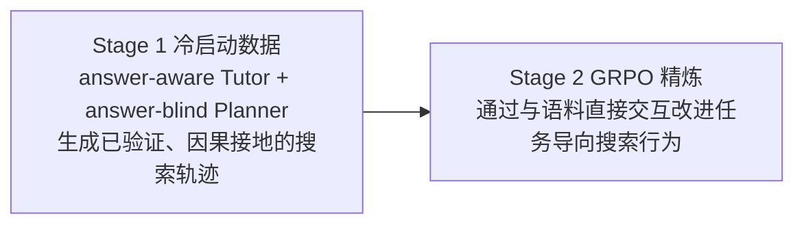

# Direct Corpus Interaction（直接语料交互）— 抛弃 embedding 检索器，让 agent 直接 grep 原始语料

> **论文一**：Beyond Semantic Similarity，arXiv 2605.05242（2026.05）｜**机构**：TIGER-Lab｜**HF 月榜**：2026-05 月榜 #33，123↑｜**关键词**：Direct Corpus Interaction · Terminal Tools · Interface Resolution · Training-free｜**GitHub**：[DCI-Agent/DCI-Agent-Lite](https://github.com/DCI-Agent/DCI-Agent-Lite)（340★）
>
> **论文二**：GrepSeek，arXiv 2605.29307（2026.05）｜**机构**：University of Massachusetts Amherst（UMass）｜**HF 月榜**：2026-06 月榜 #12，106↑｜**关键词**：DCI · Shell Commands · Cold-start (Tutor/Planner) · GRPO · Sharded-Parallel Execution｜**GitHub**：[alirezasalemi7/grepseek](https://github.com/alirezasalemi7/grepseek)（42★）

---

## 1. 这篇论文为什么重要

**一句话**：这两篇都**否定了「embedding 检索器 + 固定 top-k 相似度接口」**作为 agentic search 的默认接口，转而让 **agent 直接对原始语料发 shell/grep 命令**——把「检索质量」从「向量空间里的语义相似度」重新定义为「**模型与语料交互的接口分辨率（interface resolution）**」。

为什么这是 agentic search 的关键进展：

- **Beyond Semantic（分析/training-free）**：现代检索系统无论 lexical 还是 semantic，都通过一个**固定相似度接口**把「访问」压缩成**推理前的单步 top-k 检索**。这对 agentic search 是瓶颈——精确词法约束、稀疏线索合取（sparse clue conjunctions）、局部上下文检查、多步假设精炼都很难用现成 retriever 实现；更致命的是**早期被过滤掉的证据，再强的下游推理也无法恢复**。解法 DCI：agent 用**通用终端工具**（grep、文件读取、shell、轻量脚本）**直接搜原始语料**，**不用任何 embedding 模型、向量索引或检索 API**。
- **GrepSeek（训练 + 工程）**：同样把**语料本身当作搜索环境**，agent 靠**可执行 shell 命令**找证据。但它进一步加了 **RL 训练**和一套**并行执行引擎**，让 DCI 在大规模下真正可用。

两者一起读，正好覆盖 DCI 的「**为什么（分析）→ 怎么训 + 怎么跑得快（工程）**」全链条。它们与 [[06-openresearcher]] 的离线浏览器原语（search/open/find）同向——都让 agent **直接操作离线语料**而非调黑盒 web API；也与 [[code-as-harness]] 的「代码/shell 作为 agent 基底」共振：**把检索变成 agent 可编程操作的对象**。

---

## 2. 核心方法

### 2.1 Beyond Semantic Similarity：把检索接口换成终端工具（training-free）

**诊断——固定相似度接口为何成为 agentic 瓶颈**：

| Agentic 需求 | 为何现成 retriever 难办 |
| --- | --- |
| 精确词法约束（exact lexical constraints） | 相似度匹配对精确字面约束不敏感 |
| 稀疏线索合取（sparse clue conjunctions） | 多个弱线索的「与」难以用单次 top-k 表达 |
| 局部上下文检查（local context checks） | 需要看文档内的局部上下文，而非整篇相似度 |
| 多步假设精炼（multi-step hypothesis refinement） | 需要发现中间实体、组合弱线索、观察部分证据后改计划 |
| **早期过滤不可恢复** | 被 top-k 在推理前过滤掉的证据，下游再强也捞不回 |

**方法——DCI（Direct Corpus Interaction）**：agent 用通用终端工具（`grep`、file reads、shell commands、轻量脚本）**直接搜原始语料**：

- **无 embedding 模型、无向量索引、无检索 API**；
- **无需离线索引**，天然适应**不断演化的本地语料**；
- 这是一个 **training-free / 分析性** 的设置——重点在论证「接口分辨率」这一维度，而非训练新模型。

核心论断：随着语言 agent 越来越强，**检索质量不仅取决于推理能力，也取决于模型与语料交互的接口分辨率**——DCI 由此打开了 agentic search 的**接口设计空间（interface-design space）**。

### 2.2 GrepSeek：把 DCI 训练成 agent + 并行执行引擎

GrepSeek 把同样的「语料即搜索环境、shell 命令找证据」思路**做成可训练、可大规模运行**的系统。

**两阶段训练流水线**（解决「直接在大语料上用 RL 学行为不稳定」的问题）：

| 阶段 | 机制 | 作用 |
| --- | --- | --- |
| **Stage 1：冷启动** | **answer-aware Tutor**（知道答案）+ **answer-blind Planner**（不知答案） | 生成**已验证、因果接地（causally grounded）**的搜索轨迹，先把策略初始化稳住 |
| **Stage 2：RL 精炼** | **GRPO**（Group Relative Policy Optimization） | 让 agent 通过与语料**直接交互**改进任务导向的搜索行为 |

**让 DCI 实用化的关键——语义保持的分片并行执行引擎（semantics-preserving sharded-parallel execution engine）**：

- 把基于 shell 的检索**加速至多 7.6×**；
- **字节级等价（byte-exact equivalence）**：并行执行结果与 shell 命令的顺序执行**逐字节相同**——加速不改变语义。

直觉：grep/shell 在大语料上顺序跑会很慢，分片并行是让 DCI 从「概念验证」走向「可落地」的工程支点。

### 2.3 两者对照

| 维度 | Beyond Semantic Similarity | GrepSeek |
| --- | --- | --- |
| 定位 | **分析 / training-free** | **训练 + 工程系统** |
| 是否训练模型 | 否 | 是（冷启动 SFT + GRPO） |
| 工具 | grep / file reads / shell / 脚本 | 可执行 shell 命令 |
| 工程加速 | 未涉及 | 分片并行引擎，≤7.6×，字节级等价 |
| 核心贡献 | 提出「接口分辨率」维度，打开接口设计空间 | 把 DCI 训成 compact agent + 可规模化执行 |

---

## 3. 关键实验结果

| 论文 | 评测设置 | 关键数字 / 结论 |
| --- | --- | --- |
| **Beyond Semantic** | IR 基准（BRIGHT / BEIR）若干数据集 | **大幅超越**强 sparse / dense / reranking 基线 |
| **Beyond Semantic** | 端到端 agentic search（BrowseComp-Plus + multi-hop QA） | **强准确率，且不依赖任何传统语义检索器** |
| **GrepSeek** | 7 个开放域 QA 基准 | **整体最强的 token 级 $F_1$ 与 Exact Match（EM）** |
| **GrepSeek** | 执行效率 | shell 检索**加速至多 7.6×**，与顺序执行**字节级等价** |

> **数字披露说明**：两篇摘要均以「substantially outperforms / strongest overall」等定性表述为主，**BRIGHT/BEIR 各数据集、BrowseComp-Plus、7 个 QA 基准的具体分值摘要未披露，需读 PDF**。GrepSeek 的 **7.6× 加速 + 字节级等价** 是摘要明确给出的可量化结论。

---

## 4. 对领域的影响 / 后续方向

### 🌟 学界影响

1. **「检索接口」成为可设计的维度**
   - Beyond Semantic 提出「retrieval quality depends on interface resolution」，把研究焦点从「更好的 embedding」转向「更高分辨率的接口」——这是对 RAG 默认范式的一次根本性挑战。
2. **DCI 从理念走向可训练、可规模化系统**
   - GrepSeek 的两阶段训练 + 并行引擎，证明 DCI 不止是「能跑通的 demo」，而是可训出 compact agent 且大规模可用——补齐了 Beyond Semantic 缺的「训练 + 工程」一环。
3. **与离线语料/代码基底范式合流**
   - 与 [[06-openresearcher]] 的离线浏览器原语、[[code-as-harness]] 的代码即 agent 基底共同推动「**agent 直接、可编程地操作语料**」这一趋势。

### ⚠ 局限：lexical vs semantic 的开放问题

- **纯词法交互的天花板**：**GrepSeek 明确指出**，纯 lexical 交互在**表面形式变异大（substantial surface-form variation）**的查询上有局限——同义改写、形态变化等 grep 抓不到。这正是 DCI 与语义检索的**互补边界**：DCI 强在精确/局部/多步，弱在语义泛化。
- **两篇均未公布各基准的具体分值**，复现需读 PDF。
- DCI 在**超大语料**上的延迟即便有 7.6× 加速是否仍可接受、对存储/IO 的要求，摘要未充分量化。
- Beyond Semantic 为 training-free 分析，DCI agent 行为的稳定性与上限仍依赖底座模型能力。

### 🔮 揭示的趋势

1. **接口设计空间被打开**：未来可能出现「lexical（grep/shell）+ semantic（embedding）混合接口」——用 DCI 处理精确/局部约束，用语义检索处理表面变异，二者按查询类型路由。
2. **检索 = agent 的可编程操作**：把检索从「黑盒 API 调用」变成「agent 写脚本操作语料」，与 agentic coding 范式收敛。
3. **执行引擎成为 DCI 落地关键**：GrepSeek 的「语义保持并行」提示——DCI 的工程化（而非仅算法）是规模化的真正瓶颈。

### 📊 同方向工作

- [[06-openresearcher]]：离线语料 + search/open/find 原语，同属「agent 直接操作离线语料」，与 DCI 的 grep/shell 路线互为镜像。
- [[code-as-harness]]（huggingface/20）：代码/shell 作为 agent 基底——DCI 把检索纳入这一范式。
- [[09-harness-1]]：从「怎么训搜索 agent + 管状态」角度切入，与 DCI 的「换接口」形成「训练范式 ↔ 接口范式」两条主线。
- [[05-openseeker]]、[[08-opensearch-vl]]：仍基于检索器训练搜索 agent，与 DCI 的「抛弃检索器」形成路线对照。

---

## 5. 资源

- **Beyond Semantic Similarity**
  - **arXiv**：https://arxiv.org/abs/2605.05242
  - **HF Papers**：https://huggingface.co/papers/2605.05242（123↑）
  - **GitHub**：https://github.com/DCI-Agent/DCI-Agent-Lite（340★）
  - **机构**：TIGER-Lab
- **GrepSeek**
  - **arXiv**：https://arxiv.org/abs/2605.29307
  - **HF Papers**：https://huggingface.co/papers/2605.29307（106↑）
  - **GitHub**：https://github.com/alirezasalemi7/grepseek（42★）
  - **机构**：University of Massachusetts Amherst（UMass）
  - **训练**：冷启动（answer-aware Tutor + answer-blind Planner）→ GRPO；分片并行执行引擎（≤7.6×，字节级等价）
